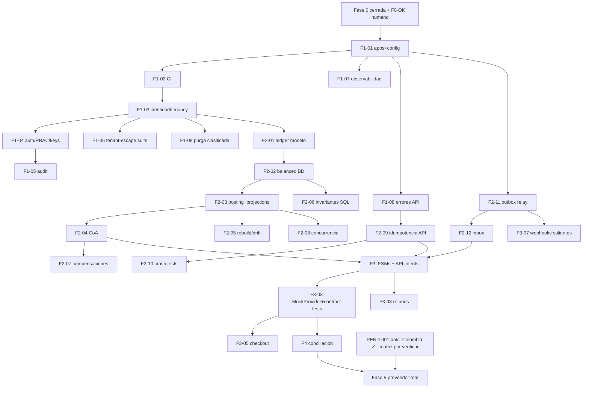

# Backlog priorizado

Estado: Activo · Fuente única de trabajo · Formato §48: cada ítem lleva ID, dominio, dependencias, riesgo, criterios de aceptación (CA), pruebas y talla. Prioridades: P0 = siguiente fase ejecutable, P1, P2, P3, Futuro.

## P0 — Cierre de Fase 0 + Fase 1 (Fundación)

| ID | Título | Dominio | Deps | Riesgo | Talla | CA / Pruebas | Estado |
|----|--------|---------|------|--------|-------|--------------|--------|
| F0-VER | Verificar licencias/mantenimiento de referencias en vivo | Gobernanza | acceso a repos | Bajo | XS | Matriz actualizada con licencia verificada + fecha | Pendiente (bloqueado por red de esta sesión) |
| F0-OK | Revisión humana del paquete de Fase 0 | Gobernanza | — | — | S | Propietario aprueba decisiones y ADRs | **Completado 2026-07-04** (Fase 0 aprobada; país = Colombia) |
| F1-01 | Estructura de apps (`apps/api`, `apps/worker`) + config por entorno tipada | Plataforma | F0-OK | Bajo | S | App Fastify arranca con health/readiness; config Zod-validada falla rápido | **Completado 2026-07-04** (46 tests verdes + smoke test) |
| F1-02 | CI completo: install reproducible, lint, typecheck, unit, integración con PG real, secret/dependency scanning, SBOM | Plataforma | F1-01 | Medio | M | Pipeline verde requerido para merge; migration dry-run incluido | **Completado 2026-07-04** (workflow publicado; Redis se añade al pipeline cuando exista consumidor real) |
| F1-03 | Modelo identidad/tenancy: organizations, merchants, users, memberships (migra el `tenants` del spike) | Identidad | F1-02 | Alto | L | CRUD con RLS; migración expand-contract desde spike; tests de integración | **Completado 2026-07-04** (migración 0003 + @fluvia/identity, 15 tests de integración) |
| F1-04 | Auth: registro, verificación email, login, MFA TOTP, sesiones revocables, RBAC, API keys con scopes | Identidad | F1-03 | Alto | XL | Suite authN/authZ + BOLA por endpoint; step-up para acciones sensibles | **Parcial**: (a) completada — registro/login/lockout/sesiones+rol fluvia_auth; (c) completada 2026-07-04 — API keys con scopes+entorno (secreto una sola vez), RBAC declarativo por endpoint, endpoints de organizations/merchants/api-keys y /v1/account, con tests BOLA y de planos no intercambiables. Pendiente SOLO (b) **ampliada por AUD-P1-006**: MFA TOTP + step-up en `keys:manage` + rate limiting por IP/email/ruta. Gate de sandbox compartido/usuarios reales (decisión de modelo: PEND-005) |
| F1-05 | Audit log append-only + access matrix | Seguridad | F1-04 | Medio | M | Acciones sensibles auditadas con actor/razón; matriz publicada | **Completado 2026-07-04** (migración 0006 + @fluvia/audit; auditoría atómica con la acción; matriz publicada en F1-04c y ampliada con audit:read) |
| F1-06 | Suite ampliada de tenant-escape + bypass administrativo controlado | Seguridad | F1-03 | Alto | M | Gate Multi-tenant técnico en verde | **Completado 2026-07-04** (13 tests de escape + meta-tests pg_catalog + withPlatformOperation auditado; Gate Multi-tenant 🟢 técnico) |
| F1-07 | Observabilidad base: pino+correlation, OTel, métricas, tablero | Plataforma | F1-01 | Medio | M | Trazas extremo a extremo en local; alertas baseline | Pendiente |
| F1-08 | Taxonomía de errores de API + formato estable + Request-Id | API | F1-01 | Medio | S | Catálogo versionado; errores legibles por máquina; tests de contrato | **Completado 2026-07-04** (catálogo v1 con 26 códigos + golden como contrato en git; sobre estable `{type, code, message, details?, request_id}`; mensajes internos SOLO a logs — AUD-P2-009; coherencia categoría↔HTTP probada; forma default de Fastify irrepresentable; doc espejo `api-errors.md`) |
| F1-09 | Política de purga por clasificación de datos (relajar DELETE en `idempotency_keys`/sesiones vía job auditado) · **+AUD-P2-008**: migración 0002 falla fuera de local si los roles no llegan con password gestionado | Datos | F1-03 | Medio | S | Purga solo por job con auditoría; triggers intactos en clases financieras; guard de entorno en roles | Pendiente |
| F1-10 | Seeds deterministas por entorno + datos de demo | Plataforma | F1-03 | Bajo | S | `pnpm seed` reproducible; staging sin datos reales | Pendiente |

## P1 — Fase 2 (Núcleo financiero)

| ID | Título | Deps | Riesgo | Talla | CA / Pruebas |
|----|--------|------|--------|-------|--------------|
| F2-01 | `ledger_transactions` con source causal + `reverses_tx_id`; promover `@fluvia/money` del spike | F1-03 | Alto | M | **Completado 2026-07-04** (migración 0007; money ya operativo como paquete desde Fase 0) |
| F2-02 | Constraint trigger diferido: balanceo por (tx, moneda) | F2-01 | Alto | S | **Completado 2026-07-04** (FLUVIA_UNBALANCED + FLUVIA_EMPTY_TRANSACTION; test negativo con superusuario incluido) |
| F2-03 | `balance_projections` versionada separada + `LedgerService.postTransaction` (locking ordenado, retry limitado) | F2-02 | Alto | L | **Completado 2026-07-04** (@fluvia/ledger: posting normativo completo, idempotencia con huella, outbox en misma tx, verifyProjection; 10 tests de integración incl. carrera de idempotencia y smoke de concurrencia) |
| F2-04 | Chart of Accounts + reglas de posting con golden tests | F2-03 | Alto | M | **Completado 2026-07-04** (CHART_OF_ACCOUNTS 13 cuentas + PostingService: capture/release/refund con golden tests exactos, modelo bruto sandbox v1, doc espejo actualizado con desviación registrada) |
| F2-05 | Rebuild de proyecciones + drift check programado (**cierra AUD-P2-004**) | F2-03 | Alto | M | **Completado 2026-07-04** (rebuildProjection bajo lock de cuenta + property test con transferencias y rebuilds concurrentes + `ledger_projection_drift()` definer solo-worker + watcher programado en apps/worker con alerta por log) |
| F2-06 | `scripts/verify-ledger-invariants.sql` externo al ORM + integración CI (**AUD-P2-012**) | F2-02 | Medio | S | **Completado 2026-07-04** (script autocontenido con 6 checks; paso de CI vía psql tras la suite; corrupción sembrada detectada y reparación explícita probadas) |
| F2-07 | Compensaciones/reversals | F2-04 | Alto | M | **Completado 2026-07-04** (`reverseTransaction`: espejo exacto con suma neta probada, reversión única por índice único de motor con carrera de 4 concurrentes probada, prohibido revertir reversiones, razón obligatoria + audit atómico, idempotente con replay — bug de replay-vs-precheck cazado por el test y corregido) |
| F2-08 | Suite de concurrencia del ledger | F2-03 | Alto | M | **Completado 2026-07-04** (suite formal con PRNG seeded reproducible: 120 transferencias aleatorias concurrentes con conservación exacta, presión de deadlock A↔B, carrera masiva de idempotencia 10×5 ⇒ exactamente 10, presión mixta postings+rebuilds+reversal; baseline local 151 tx/s en STATE) |
| F2-09 | Capa de idempotencia API (**AUD-P1-003**) | F1-08 | Alto | M | **Completado 2026-07-04** (`@fluvia/idempotency`: claim en la MISMA tx que el efecto, hash canónico, 5 casos del contrato probados incl. HTTP con sobre del catálogo — códigos `idempotency_key_required`/`processing_in_flight`/`idempotency_key_reuse` añadidos al catálogo v1 tal como exige el doc; migración 0013 `expires_at`) |
| F2-10 | Pruebas de crash-recovery de idempotencia | F2-09 | Alto | S | **Completado 2026-07-04** (crash pre-COMMIT ⇒ ni key ni efecto, reintento limpio; post-COMMIT ⇒ replay sin re-ejecutar; carrera 8→1; property: toda secuencia de reintentos ⇒ efectos==1; sin Redis en el camino ⇒ su pérdida es irrelevante — **Gate Idempotencia 🟢 técnico**) |
| F2-11 | Outbox relay worker (**AUD-P1-004** + **AUD-P1-007** + **AUD-P2-005**) | F1-01 | Alto | M | **Completado 2026-07-04** (migración 0009 + `@fluvia/events` + `@fluvia/outbox` + ADR-0011: claim-lease SKIP LOCKED, 2 workers sin doble entrega probado, backoff+jitter, veneno→dead, replay auditado con razón, rol relay de privilegio mínimo SIN BYPASSRLS, envelope validado en producción y despacho) |
| F2-12 | Inbox `provider_events` (**AUD-P1-005**) | F2-11 | Alto | M | **Completado 2026-07-04** (migración 0010 + `@fluvia/inbox`: firma HMAC pre-persistencia, dedup UNIQUE race-safe probado con N entregas concurrentes, procesador claim-lease con rol `fluvia_inbox` mínimo, veneno→dead+DLQ redactada, `ignored_out_of_order` terminal, replay auditado) |

## P2 — Fase 3 (Sandbox de pagos)

F3-01 FSMs declarativas (intent/attempt/refund) + servicio de transiciones + rediseño `payment_intents` con **meta-test FSM↔DDL** (AUD-P2-002/011) · F3-02 API `/v1/payment_intents` + customers (idempotente, OpenAPI) · F3-03 MockPaymentProvider (tokenización simulada, eventos asíncronos, fallas inyectables) + contract tests del adapter · F3-04 Circuit breaker + timeouts + política de indeterminado · F3-05 Checkout session app (Next.js, i18n es/en, WCAG AA) · F3-06 Payment links · F3-07 Webhooks salientes (motor + SSRF guard + rotación) · F3-08 Refunds E2E con ledger compensatorio · F3-09 Dashboard mínimo · F3-10 SDK TS generado de OpenAPI · F3-11 CORS + security headers + Dockerfile/compose completo (AUD-P2-016, AUD-P3-003).

## P3 — Fase 4 (Conciliación y operaciones)

F4-01 Reportes del MockProvider con discrepancias inyectables · F4-02 Motor de conciliación batch + continua · F4-03 Casos operativos con four-eyes · F4-04 Panel admin · F4-05 Abstracciones fees/reserves/settlement/payout (contables, bloqueadas) · F4-06 Runbooks + drills.

## AUD — Integración de la Auditoría Independiente v1

Reconciliación completa: `docs/audits/audit-integration-plan-v1.md` · estado vivo por hallazgo: `docs/audits/audit-closure-register-v1.md`.

| ID | Título | Deps | Riesgo | Talla | Estado |
|----|--------|------|--------|-------|--------|
| AUD-1 | Lote de remediación inmediata: 0008 (FK compuesta + endpoint en idempotency_keys + REVOKE worker) · guard `nonNegativeAccounts` · huella idempotente completa · bloqueo live keys · anti-mezcla dbUrls · README/estados docs/reservas | — | Alto | M | **Completado 2026-07-04** (cierra AUD-P1-001/008/009/010, P2-001/003/013/014, P3-001/002; mitiga P1-007 y P2-004) |
| AUD-P2-015 | API keys: `key_hash_version` + HMAC server-side | F1-04c | Medio | M | Pendiente — bloqueante para sandbox compartido (PEND-006) |

Los demás hallazgos abiertos NO son ítems nuevos: viven dentro de F1-04b, F1-08, F1-09, F2-05, F2-06, F2-09, F2-11, F2-12, F3-01, F3-11, F4 (marcados arriba) — sin duplicación.

## Futuro (no planificar aún)

Proveedor real (Fase 5 — país ya decidido: Colombia; bloqueada por la verificación legal de la matriz de jurisdicción), hardening (Fase 6), production readiness (Fase 7), disputas completas, billing (ver Lago), multi-país.

## DAG

Regla §49 respetada: idempotencia (F2-09) precede a la exposición de la API financiera mutante (F3-02).
