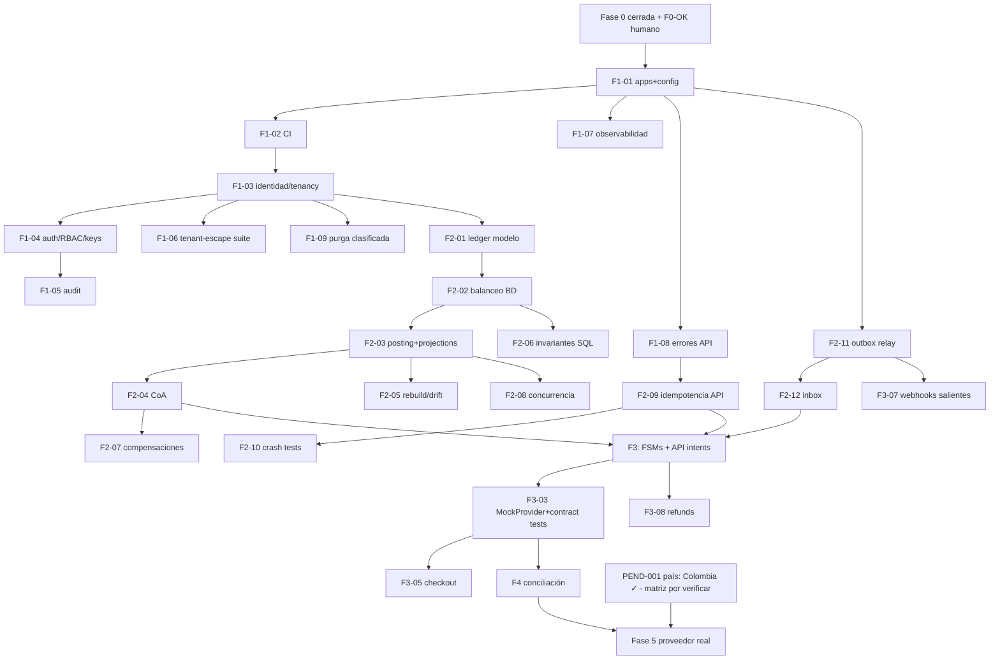

# Backlog priorizado

Estado: Activo · Fuente única de trabajo · Formato §48: cada ítem lleva ID, dominio, dependencias, riesgo, criterios de aceptación (CA), pruebas y talla. Prioridades: P0 = siguiente fase ejecutable, P1, P2, P3, Futuro.

## P0 — Cierre de Fase 0 + Fase 1 (Fundación)

| ID     | Título                                                                                                                                                                                                              | Dominio    | Deps           | Riesgo | Talla | CA / Pruebas                                                                                         | Estado                                                                                                                                                                                                                                                                                                                                                                                                                                                                                                                                                                                                                                                                                                                                                                                                                              |
| ------ | ------------------------------------------------------------------------------------------------------------------------------------------------------------------------------------------------------------------- | ---------- | -------------- | ------ | ----- | ---------------------------------------------------------------------------------------------------- | ----------------------------------------------------------------------------------------------------------------------------------------------------------------------------------------------------------------------------------------------------------------------------------------------------------------------------------------------------------------------------------------------------------------------------------------------------------------------------------------------------------------------------------------------------------------------------------------------------------------------------------------------------------------------------------------------------------------------------------------------------------------------------------------------------------------------------------- |
| F0-VER | Verificar licencias/mantenimiento de referencias en vivo                                                                                                                                                            | Gobernanza | acceso a repos | Bajo   | XS    | Matriz actualizada con licencia verificada + fecha                                                   | Pendiente (bloqueado por red de esta sesión)                                                                                                                                                                                                                                                                                                                                                                                                                                                                                                                                                                                                                                                                                                                                                                                        |
| F0-OK  | Revisión humana del paquete de Fase 0                                                                                                                                                                               | Gobernanza | —              | —      | S     | Propietario aprueba decisiones y ADRs                                                                | **Completado 2026-07-04** (Fase 0 aprobada; país = Colombia)                                                                                                                                                                                                                                                                                                                                                                                                                                                                                                                                                                                                                                                                                                                                                                        |
| F1-01  | Estructura de apps (`apps/api`, `apps/worker`) + config por entorno tipada                                                                                                                                          | Plataforma | F0-OK          | Bajo   | S     | App Fastify arranca con health/readiness; config Zod-validada falla rápido                           | **Completado 2026-07-04** (46 tests verdes + smoke test)                                                                                                                                                                                                                                                                                                                                                                                                                                                                                                                                                                                                                                                                                                                                                                            |
| F1-02  | CI completo: install reproducible, lint, typecheck, unit, integración con PG real, secret/dependency scanning, SBOM                                                                                                 | Plataforma | F1-01          | Medio  | M     | Pipeline verde requerido para merge; migration dry-run incluido                                      | **Completado 2026-07-04** (workflow publicado; Redis se añade al pipeline cuando exista consumidor real)                                                                                                                                                                                                                                                                                                                                                                                                                                                                                                                                                                                                                                                                                                                            |
| F1-03  | Modelo identidad/tenancy: organizations, merchants, users, memberships (migra el `tenants` del spike)                                                                                                               | Identidad  | F1-02          | Alto   | L     | CRUD con RLS; migración expand-contract desde spike; tests de integración                            | **Completado 2026-07-04** (migración 0003 + @fluvia/identity, 15 tests de integración)                                                                                                                                                                                                                                                                                                                                                                                                                                                                                                                                                                                                                                                                                                                                              |
| F1-04  | Auth: registro, verificación email, login, MFA TOTP, sesiones revocables, RBAC, API keys con scopes                                                                                                                 | Identidad  | F1-03          | Alto   | XL    | Suite authN/authZ + BOLA por endpoint; step-up para acciones sensibles                               | **Parcial**: (a) completada — registro/login/lockout/sesiones+rol fluvia_auth; (c) completada 2026-07-04 — API keys con scopes+entorno (secreto una sola vez), RBAC declarativo por endpoint, endpoints de organizations/merchants/api-keys y /v1/account, con tests BOLA y de planos no intercambiables. **COMPLETO 2026-07-04** — (b) cerrada por F1-04b (AUD-P1-006, PEND-005 resuelta): TOTP RFC 6238 propio verificado contra vectores del RFC + secreto cifrado AES-256-GCM en reposo + 10 códigos de respaldo de un solo uso (solo sha256 en BD) + reto post-password de 5 min + anti-replay por step + fallos MFA alimentan el MISMO lockout + step-up (15 min) en `keys:manage` + rate limiting por email/IP en auth (429 `rate_limited` + Retry-After; in-memory Nivel C — store compartido antes del sandbox compartido) |
| F1-05  | Audit log append-only + access matrix                                                                                                                                                                               | Seguridad  | F1-04          | Medio  | M     | Acciones sensibles auditadas con actor/razón; matriz publicada                                       | **Completado 2026-07-04** (migración 0006 + @fluvia/audit; auditoría atómica con la acción; matriz publicada en F1-04c y ampliada con audit:read)                                                                                                                                                                                                                                                                                                                                                                                                                                                                                                                                                                                                                                                                                   |
| F1-06  | Suite ampliada de tenant-escape + bypass administrativo controlado                                                                                                                                                  | Seguridad  | F1-03          | Alto   | M     | Gate Multi-tenant técnico en verde                                                                   | **Completado 2026-07-04** (13 tests de escape + meta-tests pg_catalog + withPlatformOperation auditado; Gate Multi-tenant 🟢 técnico)                                                                                                                                                                                                                                                                                                                                                                                                                                                                                                                                                                                                                                                                                               |
| F1-07  | Observabilidad base: pino+correlation, OTel, métricas, tablero                                                                                                                                                      | Plataforma | F1-01          | Medio  | M     | Trazas extremo a extremo en local; alertas baseline                                                  | **Completado 2026-07-05** (`@fluvia/observability` propio: counter/gauge/histogram + exposición Prometheus con guard de cardinalidad; API instrumentada por plantilla de ruta + `GET /metrics`; worker con servidor `/health`+`/metrics` (`WORKER_METRICS_PORT`) e instrumentación de relay/drift/heartbeat; alertas baseline en `observability.md` §4. **Desviación registrada**: OTel diferido hasta collector real (F6) — SDK sin backend sería capacidad simulada; correlación extremo a extremo hoy = `request_id` en logs/auditoría. Tablero fuera del repo hasta F6)                                                                                                                                                                                                                                                         |
| F1-08  | Taxonomía de errores de API + formato estable + Request-Id                                                                                                                                                          | API        | F1-01          | Medio  | S     | Catálogo versionado; errores legibles por máquina; tests de contrato                                 | **Completado 2026-07-04** (catálogo v1 con 26 códigos + golden como contrato en git; sobre estable `{type, code, message, details?, request_id}`; mensajes internos SOLO a logs — AUD-P2-009; coherencia categoría↔HTTP probada; forma default de Fastify irrepresentable; doc espejo `api-errors.md`)                                                                                                                                                                                                                                                                                                                                                                                                                                                                                                                              |
| F1-09  | Política de purga por clasificación de datos (relajar DELETE en `idempotency_keys`/sesiones vía job auditado) · **+AUD-P2-008**: migración 0002 falla fuera de local si los roles no llegan con password gestionado | Datos      | F1-03          | Medio  | S     | Purga solo por job con auditoría; triggers intactos en clases financieras; guard de entorno en roles | **Completado 2026-07-05** (migración 0015: `purge_technical_data()` SECURITY DEFINER sin parámetros — 4 clases técnicas con retenciones fijas, auditoría atómica en la misma tx, EXECUTE solo worker; trigger técnico con escape SOLO transaccional; clases financieras con trigger original intacto (probado con GUC activo); `TechnicalPurgeJob` en worker con métricas. AUD-P2-008: `fluvia_assert_dev_role_creation` en las 4 migraciones de roles + GUC `fluvia.environment` del runner — probado end-to-end en BD efímera + meta-test 5/5 altas con guard)                                                                                                                                                                                                                                                                    |
| F1-10  | Seeds deterministas por entorno + datos de demo                                                                                                                                                                     | Plataforma | F1-03          | Bajo   | S     | `pnpm seed` reproducible; staging sin datos reales                                                   | **Completado 2026-07-05** (`@fluvia/seeds`: IDs UUID v5 deterministas, identidad por ON CONFLICT, ledger por la VÍA NORMATIVA con replay de idempotencia — re-ejecutar añade CERO filas (probado contando); guard duro: datos de demo y sus passwords SOLO local/test (sandbox se revisará con PEND-006); passwords de demo verificados autenticables)                                                                                                                                                                                                                                                                                                                                                                                                                                                                              |

## P1 — Fase 2 (Núcleo financiero)

| ID    | Título                                                                                                         | Deps  | Riesgo | Talla | CA / Pruebas                                                                                                                                                                                                                                                                                                                         |
| ----- | -------------------------------------------------------------------------------------------------------------- | ----- | ------ | ----- | ------------------------------------------------------------------------------------------------------------------------------------------------------------------------------------------------------------------------------------------------------------------------------------------------------------------------------------ |
| F2-01 | `ledger_transactions` con source causal + `reverses_tx_id`; promover `@fluvia/money` del spike                 | F1-03 | Alto   | M     | **Completado 2026-07-04** (migración 0007; money ya operativo como paquete desde Fase 0)                                                                                                                                                                                                                                             |
| F2-02 | Constraint trigger diferido: balanceo por (tx, moneda)                                                         | F2-01 | Alto   | S     | **Completado 2026-07-04** (FLUVIA_UNBALANCED + FLUVIA_EMPTY_TRANSACTION; test negativo con superusuario incluido)                                                                                                                                                                                                                    |
| F2-03 | `balance_projections` versionada separada + `LedgerService.postTransaction` (locking ordenado, retry limitado) | F2-02 | Alto   | L     | **Completado 2026-07-04** (@fluvia/ledger: posting normativo completo, idempotencia con huella, outbox en misma tx, verifyProjection; 10 tests de integración incl. carrera de idempotencia y smoke de concurrencia)                                                                                                                 |
| F2-04 | Chart of Accounts + reglas de posting con golden tests                                                         | F2-03 | Alto   | M     | **Completado 2026-07-04** (CHART_OF_ACCOUNTS 13 cuentas + PostingService: capture/release/refund con golden tests exactos, modelo bruto sandbox v1, doc espejo actualizado con desviación registrada)                                                                                                                                |
| F2-05 | Rebuild de proyecciones + drift check programado (**cierra AUD-P2-004**)                                       | F2-03 | Alto   | M     | **Completado 2026-07-04** (rebuildProjection bajo lock de cuenta + property test con transferencias y rebuilds concurrentes + `ledger_projection_drift()` definer solo-worker + watcher programado en apps/worker con alerta por log)                                                                                                |
| F2-06 | `scripts/verify-ledger-invariants.sql` externo al ORM + integración CI (**AUD-P2-012**)                        | F2-02 | Medio  | S     | **Completado 2026-07-04** (script autocontenido con 6 checks; paso de CI vía psql tras la suite; corrupción sembrada detectada y reparación explícita probadas)                                                                                                                                                                      |
| F2-07 | Compensaciones/reversals                                                                                       | F2-04 | Alto   | M     | **Completado 2026-07-04** (`reverseTransaction`: espejo exacto con suma neta probada, reversión única por índice único de motor con carrera de 4 concurrentes probada, prohibido revertir reversiones, razón obligatoria + audit atómico, idempotente con replay — bug de replay-vs-precheck cazado por el test y corregido)         |
| F2-08 | Suite de concurrencia del ledger                                                                               | F2-03 | Alto   | M     | **Completado 2026-07-04** (suite formal con PRNG seeded reproducible: 120 transferencias aleatorias concurrentes con conservación exacta, presión de deadlock A↔B, carrera masiva de idempotencia 10×5 ⇒ exactamente 10, presión mixta postings+rebuilds+reversal; baseline local 151 tx/s en STATE)                                 |
| F2-09 | Capa de idempotencia API (**AUD-P1-003**)                                                                      | F1-08 | Alto   | M     | **Completado 2026-07-04** (`@fluvia/idempotency`: claim en la MISMA tx que el efecto, hash canónico, 5 casos del contrato probados incl. HTTP con sobre del catálogo — códigos `idempotency_key_required`/`processing_in_flight`/`idempotency_key_reuse` añadidos al catálogo v1 tal como exige el doc; migración 0013 `expires_at`) |
| F2-10 | Pruebas de crash-recovery de idempotencia                                                                      | F2-09 | Alto   | S     | **Completado 2026-07-04** (crash pre-COMMIT ⇒ ni key ni efecto, reintento limpio; post-COMMIT ⇒ replay sin re-ejecutar; carrera 8→1; property: toda secuencia de reintentos ⇒ efectos==1; sin Redis en el camino ⇒ su pérdida es irrelevante — **Gate Idempotencia 🟢 técnico**)                                                     |
| F2-11 | Outbox relay worker (**AUD-P1-004** + **AUD-P1-007** + **AUD-P2-005**)                                         | F1-01 | Alto   | M     | **Completado 2026-07-04** (migración 0009 + `@fluvia/events` + `@fluvia/outbox` + ADR-0011: claim-lease SKIP LOCKED, 2 workers sin doble entrega probado, backoff+jitter, veneno→dead, replay auditado con razón, rol relay de privilegio mínimo SIN BYPASSRLS, envelope validado en producción y despacho)                          |
| F2-12 | Inbox `provider_events` (**AUD-P1-005**)                                                                       | F2-11 | Alto   | M     | **Completado 2026-07-04** (migración 0010 + `@fluvia/inbox`: firma HMAC pre-persistencia, dedup UNIQUE race-safe probado con N entregas concurrentes, procesador claim-lease con rol `fluvia_inbox` mínimo, veneno→dead+DLQ redactada, `ignored_out_of_order` terminal, replay auditado)                                             |

## P2 — Fase 3 (Sandbox de pagos)

~~F3-01~~ **Completado 2026-07-05** (decisión #24: adelantado a la re-auditoría; migración 0017 + `@fluvia/payments-core` + meta-test triple doc↔TS↔DDL + matriz de motor 144+64 pares — cierra AUD-P2-002 y AUD-P2-011) · ~~F3-02~~ **Completado 2026-07-05** (endpoints create/get/list/cancel con `Idempotency-Key` obligatoria vía capa F2-09 — replay exacto probado sobre HTTP —, scopes read/payments:write, catálogo +`invalid_state_transition` (35 códigos, golden regen), contrato `docs/api/openapi.v1.json` con test spec↔servidor. **Desviaciones registradas**: `confirm` diferido a F3-03 — confirmar sin proveedor sería capacidad simulada; `customers` diferido a F3-05, su primer consumidor real) · ~~F3-03~~ **Completado 2026-07-05** (a: MockProvider + confirm idempotente asíncrono + attempts con captura atómica + timeout→indeterminate; b: `tok_pse` pending, endpoint HTTP de ingesta firmada `/v1/providers/mock/webhook` — cierra el pendiente de F2-12 —, PRIMER handler real del inbox resolviendo submitted/indeterminate por fuente verificada con la misma captura atómica, InboxProcessor cableado en el worker con métricas. Pendiente en F3-04: barrido submitting→indeterminate y alerta de indeterminados envejecidos) · ~~F3-04~~ **Completado 2026-07-05** (migración 0018: `sweep_payment_attempts()` definer sin parámetros — barrido submitting→indeterminate con lease 5 min y auditoría atómica, salud de indeterminados con umbral 30 min; `AttemptsWatchdog` en worker con gauges+alerta; `ResilientProvider`: timeout duro + circuit breaker por proveedor — circuito abierto = fallo LIMPIO `provider_unavailable` porque jamás se envió, nunca ambiguo; breaker in-memory Nivel C como el rate limiter) · ~~F3-05 Checkout session app (Next.js, i18n es/en, WCAG AA)~~ **COMPLETADO 2026-07-05**: ~~F3-05a customers~~ **Completado 2026-07-05** (migración 0021: tabla `customers` con RLS forzado, append-only + baja lógica `deleted_at`, clave compuesta (id, tenant_id) para FK futuras de checkout/payment-links; semántica tipo Stripe — email NO único, se exige ≥1 de email/name/phone; metadata validada ≤50 claves; `CustomerService` en `@fluvia/identity` con update parcial (null limpia, metadata reemplaza) y softDelete idempotente; endpoints `/v1/customers` create/get/list/update/delete con scopes customers:write/read; `CustomerNotFoundError`→not_found sin código nuevo, golden regen del mapa domain; OpenAPI +5 paths). ~~F3-05b checkout sessions (recurso)~~ **Completado 2026-07-05** (migración 0022: tabla `checkout_sessions` con FK compuestas a intent y customer opcional, RLS forzado, append-only; FSM `open→completed|expired` hecha cumplir EN el motor — patrón golden, meta-test triple doc §5↔TS↔DDL + matriz de 9 pares como superusuario; `CheckoutSessionService` en `@fluvia/payments-core`: create idempotente (F2-09) sobre un intent NO resuelto, `client_secret` `cs_` entregado UNA vez con solo su hash en reposo, TTL acotado 5 min–24 h, customer opcional validado bajo RLS; endpoints `/v1/checkout_sessions` create/get/list scopes payments:write/read; config `CHECKOUT_BASE_URL`; OpenAPI +2 paths). ~~F3-05c-i backend del flujo alojado~~ **Completado 2026-07-05** (migración 0023: `checkout_session_authenticate(session_id, secret_hash)→tenant_id` SECURITY DEFINER — auth cross-tenant por `client_secret` sin API key, como `authenticate_api_key`; `CheckoutSessionService.getByClientSecret` autentica → sincroniza estado de forma perezosa e idempotente bajo lock de sesión (open→completed si el intent tuvo éxito; open→expired si venció el TTL) emitiendo `checkout_session.completed|expired` al outbox (buildEnvelope en TS, valida al emitir; el productor de esos topics ya existe) → devuelve vista REDACTADA (estado + monto/moneda/estado del intent, jamás secreto/tenant/internos); endpoint `GET /v1/checkout_sessions/:id/status` sin API key (secreto en header, 404 anti-enumeración; excluido del contrato OpenAPI como la ingesta del proveedor)). ~~F3-05c-ii barrido de entrega garantizada~~ **Completado 2026-07-05** (migración 0024: `sweep_checkout_sessions()` SECURITY DEFINER — familia purga/drift/attempts — completa las sesiones cuyo intent tuvo éxito y expira las vencidas que NADIE consultó, emitiendo `checkout_session.completed|expired` con el sobre común construido EN SQL (probado que valida contra el MISMO `EventEnvelopeSchema` que exige el relay); ramas disjuntas, intent-succeeded gana sobre TTL; `CheckoutSessionWatchdog` en el worker con métrica `fluvia_checkout_sessions_swept_total{result}`, config `CHECKOUT_WATCHDOG_*`; idempotente con la sincronización perezosa de F3-05c-i bajo el guard `status='open'`). ~~F3-05c-iii confirm alojado (backend)~~ **Completado 2026-07-05** (endpoint `POST /v1/checkout_sessions/:id/confirm` SIN API key — credencial = `client_secret` en header — que la página del comprador usa para enviar el método de pago y confirmar; `CheckoutSessionService.confirmByClientSecret` autentica (0023) → dos fases como el confirm de la API (fase 1 intent→processing + attempt bajo lock de la sesión; proveedor FUERA de tx) → sincroniza la sesión (completed si tuvo éxito, con evento). Idempotente ante doble submit: si el intent ya no es confirmable, devuelve la vista actual sin crear un segundo attempt (probado: attempts=1). Probado tok_approve→completed, tok_decline→intent failed+sesión sigue open, secreto malo→404, token faltante→400). ~~F3-05c-iv UI Next.js alojada~~ **Completado 2026-07-05** → **F3-05 COMPLETO**: `apps/checkout` (Next.js 15 App Router — subido desde 14 por el advisory crítico del gate `pnpm audit`, React 19), página `/c/[id]` que lee el `client_secret` del fragmento de la URL, consume `/status` y `/confirm` vía route handlers server-side (el navegador jamás conoce la URL de la API ni una API key), i18n es/en sin librería, WCAG AA (main/h1, fieldset/legend, labels, aria-live, foco, contraste AA, targets ≥44px). Tests de componente + accesibilidad (jsdom + axe) CI-gated; **E2E de navegador verificado LOCALMENTE** (Chromium real → API → PG: render del monto → Pagar → completado) — el CI no tiene navegador, documentado en `apps/checkout/e2e/README.md`. · ~~F3-06 Payment links~~ **Completado 2026-07-05** (migración 0025: tabla `payment_links` — plantilla "págame" reutilizable con FK compuesta al merchant, RLS forzado, append-only; función `payment_link_resolve(id)` SECURITY DEFINER cross-tenant solo para links ACTIVOS. `PaymentLinkService` en `@fluvia/payments-core`: create idempotente (F2-09, merchant validado bajo RLS)/get/list/disable; y `createSessionFromLink` PÚBLICO — resuelve el link y genera un payment_intent + checkout_session FRESCOS en UNA tx atómica (reutiliza TODO F3-05, multi-uso: cada apertura = sesión distinta). Endpoints `/v1/payment_links` create/get/list/disable (scope payments:write/read) + `POST :id/sessions` PÚBLICO sin API key (link deshabilitado/inexistente = mismo 404 anti-enumeración; excluido del contrato OpenAPI como las otras rutas sin API key). Probado end-to-end sobre HTTP: abrir el link → sesión pagable → confirmar → completado. `PaymentLinkNotFoundError`→not_found, `PaymentLinkInvalidMerchantError`→validation_error (sin códigos nuevos, 36); OpenAPI +3 paths de gestión. ~~F3-06-b UI del payment link~~ **Completado 2026-07-05** (frontend): página pública `/l/[id]` en `apps/checkout` — server component que hace el `POST :id/sessions` server-side y REDIRIGE al flujo alojado `/c/{sessionId}#{clientSecret}` (F3-05c-iv); el `client_secret` viaja en el fragmento del `Location`, nunca en los logs de la navegación posterior a `/c`. Link inválido/deshabilitado/API caída → misma vista de indisponibilidad (anti-enumeración). Lógica pura de resolución (construcción del destino con fragmento, preservación de `?lang`, 404→indisponible) + vista de indisponibilidad probadas en CI (jsdom + axe, 6 tests); la redirección real con fragmento verificada por navegador LOCAL (Chromium: `/l/{id}` → `307` con `Location: /c/{sid}#cs_…` → checkout carga `$ 77.000` → Pagar → completado)). · ~~F3-07~~ **Completado 2026-07-05** (migración 0019: 3 tablas + rol `fluvia_webhook` con ventanas ADR-0011 — el fan-out lo hace `fluvia_relay`, la entrega un rol propio; `@fluvia/webhooks`: catálogo de 13 topics con meta-test doc §5↔código, firma `v1=` HMAC-SHA256 sobre `{ts}.{event_id}.{body}` con rotación dual 24 h, secretos `whsec_` cifrados AES-256-GCM en reposo, SSRF guard §4 — https+443, denylist de TODAS las IPs resueltas, conexión PINEADA a la IP validada en CADA intento, IP registrada por attempt —, deliverer claim-lease con calendario 0s→24h→dead; API `/v1/webhook_endpoints` create/list/rotate/disable con scope `webhooks:manage`, secreto visible UNA sola vez. **Desviaciones registradas**: reenvío manual auditado de eventos dead → F3-09 (dashboard); auto-disable de endpoints crónicos con notificación → F6 — hoy la alerta `result="dead"` cubre la operación) · ~~F3-08~~ **Completado 2026-07-05** (migración 0020: tabla `refunds` + FSM `refund_transitions` hecha cumplir EN el motor — patrón golden de 0017, meta-test triple doc↔TS↔DDL + matriz de 36 pares como superusuario; `RefundService` en dos fases como confirm: fase 1 valida estado del intent + monto contra lo REMANENTE (capturado − aplicado − en vuelo) bajo `FOR UPDATE` del intent, fase 2 fuera de tx = reserva contable `refund.request` con guard de no-negatividad AUD-P1-010 → proveedor → `refund.settle`/`refund.cancel` atómico vía `onPosted`. Desenlaces del dinero probados: aprobado→refunded/partially_refunded, saldo insuficiente→canceled SIN contactar al proveedor, rechazo/circuito→failed con reserva devuelta íntegra, throw/`pending`→`indeterminate` con reserva RETENIDA (V4 §23, cerrado SOLO por `resolveFromProvider`, fuente verificada). Ingesta de webhooks de refund + watchdog de indeterminados diferidos a F4 (desviación registrada, espeja F3-03→F3-04). Endpoints `POST/GET /v1/refunds` idempotentes (scope payments:write/read), catálogo +`refund_amount_exceeds_remaining` (36 códigos, golden regen), topic `refund.canceled` añadido al catálogo de webhooks. **Cierra AUD-P1-002 por completo**) · **F3-09 Dashboard mínimo**: ~~F3-09a visibilidad de webhooks + reenvío `dead`~~ **Completado 2026-07-05** (migración 0026: columna `resent_from_event_id` + función SECURITY DEFINER acotada `webhook_event_resend` — `fluvia_app` tiene SELECT sobre la cola pero NO INSERT/UPDATE, revocados en 0019; el reenvío entra por la función. `WebhookEventService` en `@fluvia/webhooks`: `list`/`get` (con payload + historial de intentos) y `resend` — reenviar NO resucita el muerto (estado terminal inmutable), clona (tenant, endpoint, topic, payload) como evento `pending` fresco enlazado vía `resent_from_event_id`, con audit event `webhook_event.resent` en la MISMA tx. Endpoints `GET /v1/webhook_events` (filtros endpoint/status, scope `read`), `GET :id`, `POST :id/resend` (scope `webhooks:manage`); solo `dead` se reenvía (si no, `invalid_state_transition`). Cierra el diferido de F3-07. `WebhookEventNotFoundError`→not_found, `WebhookEventNotDeadError`→invalid_state_transition (sin códigos nuevos, 36; +2 domain codes → 48; golden regen); OpenAPI +3 paths. Probado vs PG real: lectura RLS por tenant + reenvío auditado + aislamiento cross-tenant). ~~F3-09b-i plano de lectura del dashboard (backend)~~ **Completado 2026-07-05** (el dashboard es para un operador HUMANO — autentica por SESIÓN y su org=tenant sale de la MEMBRESÍA, no por API key; por Nivel A el plano de lectura por sesión es prerequisito de cualquier UI. Nuevo permiso RBAC `payments:read` (matriz + meta-test celda-a-celda + `access-control.md` actualizados; lo tiene TODO rol — dato de tenant de solo lectura). Rutas `GET /v1/organizations/:orgId/{payment_intents,refunds,checkout_sessions,payment_links,webhook_events}` (list + detail) bajo `security.session`+`security.org('payments:read')`, reutilizando los MISMOS servicios y serializers que el plano de API key — una sola forma de recurso, cero duplicación de lógica (serializers exportados). Solo lectura: la única escritura de operación (reenvío `dead`) sigue en el plano de API key F3-09a. Probado vs PG real (5 tests: datos creados por API key y leídos por sesión, plano completo cableado+guardado, no-miembro→404, sin sesión→401, aislamiento por tenant). Sin migración ni deps nuevas; plano de sesión excluido del contrato OpenAPI como el resto). ~~F3-09b-ii frontend del dashboard~~ **Completado 2026-07-05** (nuevo app `apps/dashboard`, Next.js 15/React 19 siguiendo el patrón de `apps/checkout` — SEGUNDO app frontend del monorepo). Login por sesión: `/login` (client) → route handler `/api/session` proxya a la API y fija cookie **httpOnly** `fluvia_session` (el token NUNCA llega al JS del navegador; MFA fuera de alcance → se avisa, no se simula). `/` lista las organizaciones del operador (su membresía) y enlaza a `/o/[orgId]`, un server component que trae las 5 vistas del plano de lectura F3-09b-i con el token de la cookie y renderiza `DashboardView` (tablas accesibles de intents/refunds/checkout sessions/payment links + cola de webhooks, montos por moneda/locale, badges por estado). SOLO lectura (el reenvío `dead` llega después). i18n es/en, WCAG AA. Tests CI-gated: lógica pura del cliente API (login/orgs/agregación con degradación por recurso) + componente/accesibilidad (jsdom + axe, 12 tests). **E2E de navegador verificado LOCALMENTE** (Chromium real: login → cookie → picker «Dash E2E Org» → panel con intent `$ 123.000` y link `$ 45.000`; captura), documentado en `apps/dashboard/e2e/README.md`. ~~F3-09b-iii reenvío `dead` desde el panel~~ **Completado 2026-07-05** (cierra el dashboard como superficie de OPERACIÓN, no solo observación). Backend: nuevo permiso RBAC `webhooks:manage` (espeja el scope de API key homónimo en el plano de sesión; solo owner/admin/developer — matriz + meta-test + `access-control.md`), ruta `POST /v1/organizations/:orgId/webhook_events/:id/resend` (sesión + membresía + `webhooks:manage`) que reusa `WebhookEventService.resend` auditando como `actorType: user`. Frontend: botón «Reenviar» en la cola de webhooks del panel (client component) solo para eventos `dead` y solo si el rol puede (hint de UX `canResendRole`; el API es la fuente de verdad, 403 a quien no); POSTea al route handler `/api/orgs/[orgId]/webhook-events/[id]/resend` que reenvía la cookie de sesión; en éxito recarga y aparece el evento `pending` fresco. Tests CI-gated: 3 de ruta HTTP (admin→201, read_only→403, no-dead→409/no-miembro→404) + 3 de frontend (canResendRole, visibilidad del botón por rol, POST+«Reenviado»). **E2E de navegador verificado LOCALMENTE** (Chromium: login owner → panel → clic Reenviar en el `dead` → 201 → «Reenviado ✓» → recarga con la cola en 2 (dead + pending fresco); captura). Sin migración; deps ya presentes · ~~F3-10 SDK TS del OpenAPI~~ **Completado 2026-07-05** (`@fluvia/sdk`: cliente TypeScript tipado del plano de integración por API key, sin dependencias de runtime — usa `fetch` global inyectable. Cubre las 27 (método,ruta) del contrato `docs/api/openapi.v1.json`: paymentIntents/refunds/customers/checkoutSessions/paymentLinks/webhookEndpoints/webhookEvents con tipos de recurso, `FluviaApiError` que expone el sobre estable (code/request_id), e Idempotency-Key autogenerada en las creaciones que la exigen. `test/contract.test.ts` garantiza SDK ⊆⊇ contrato (si alguien añade una ruta al spec sin método en el SDK, o viceversa, revienta). `test/sdk.test.ts` ejerce el SDK contra el API REAL en proceso — el transporte `fetch` delega en `app.inject`, así que cada llamada pasa por auth/idempotencia/dominio reales: crear intent → confirm (contrato asíncrono) → refund, customers CRUD, payment links, webhook endpoints rotate, y errores tipados (404 not_found, 401). README con ejemplos de uso. Sin migración ni deps externas nuevas) · **F3-11 CORS + security headers + Dockerfile/compose completo (AUD-P2-016, AUD-P3-003)**: ~~F3-11a CORS + security headers~~ **Completado 2026-07-05** (cierra la parte de API de AUD-P2-016). Config `CORS_ALLOWED_ORIGINS` (lista por comas, no secreto, default VACÍO = ningún cross-origin — el checkout/dashboard llaman al API server-side, no desde el navegador; `*` = todos). Hook `onRequest`: allowlist explícita que hace eco del `Origin` permitido (+ `Vary: Origin`) y responde el **preflight** OPTIONS (204 con `Access-Control-Allow-Methods/Headers/Max-Age`) solo para orígenes permitidos — sin ACAO para orígenes ajenos. Hook `onSend`: cabeceras de seguridad en TODA respuesta (`X-Content-Type-Options: nosniff`, `X-Frame-Options: DENY`, `Referrer-Policy: no-referrer`, CSP `default-src 'none'; frame-ancestors 'none'` — el API es JSON, se bloquea al máximo —, `Cross-Origin-Resource-Policy: same-origin`, y `Strict-Transport-Security` SOLO fuera de local/test). 7 tests: headers presentes, HSTS ausente en test, CORS default niega, eco de origen permitido, rechazo de origen ajeno, preflight permitido/denegado. Sin migración ni deps nuevas. ~~F3-11b empaquetado de despliegue~~ **Completado 2026-07-05** (cierra AUD-P3-003, y con F3-11a cierra F3-11 → **hardening de Fase 3 COMPLETO**). `Dockerfile` multi-stage único del backend (API + worker comparten imagen; el servicio elige la app con `command`): stage `build` instala con `--frozen-lockfile` y valida tipos (`pnpm build`), stage `runtime` slim que corre como usuario **no-root** (`node`); pnpm pineado horneado en la capa base (sin descarga en runtime). `.dockerignore` (nunca copia node_modules/artefactos). `docker-compose.yml` extendido con un profile `app` (no altera el `up` por defecto de PG+Redis): servicio `migrate` (one-shot, crea roles de mínimo privilegio + esquema, `service_completed_successfully`) → `api` (:3000) + `worker` esperan a que complete, todos cableados a los roles por env (host `postgres`). **Verificado con Docker real**: `docker build` OK (install + tsc build dentro de la imagen), migraciones aplicadas en el contenedor contra PG containerizado, API arranca **no-root** y sirve `/health`+`/ready` (conecta con rol `fluvia_app`) con los security headers de F3-11a, worker arranca (purga/inbox/watchdogs/deliverer + métricas). El CI no corre docker; la verificación es local. Sin cambios de código.

## P3 — Fase 4 (Conciliación y operaciones)

~~F4-01a Motor de conciliación (núcleo)~~ **Completado 2026-07-05** (migración 0027: `settlement_reports` + `settlement_lines` (reporte de liquidación del proveedor) + `reconciliation_entries` (resultado), todas RLS por tenant + append-only. `@fluvia/reconciliation` `ReconciliationService`: `createReport`/`addLines` (ingesta idempotente por `(report, provider_ref)`)/`reconcile`/`getReport`/`listEntries`. El motor casa las líneas del proveedor contra los intentos `succeeded` del tenant (mismo proveedor/moneda, DENTRO del periodo del reporte) vía un FULL OUTER JOIN por `provider_ref` y clasifica cada referencia: **matched / amount_mismatch / missing_in_ledger / missing_at_provider**; persiste `reconciliation_entries` + marca el reporte `reconciled` en UNA transacción. Append-only: un reporte se concilia UNA vez (`ReportAlreadyReconciledError`). Per-tenant bajo RLS, sin definer (la liquidación cross-tenant a nivel plataforma es refinamiento futuro). 4 tests vs PG real: las 4 clases de discrepancia, respeto del periodo, idempotencia de `addLines`, guard de conciliar-una-vez, aislamiento por tenant. Sin deps externas nuevas) · ~~F4-01b Gestión de conciliación (API de integración)~~ **Completado 2026-07-05** (plano de API key; carga del reporte + disparo de la conciliación + consulta del resultado). `ReconciliationService` +`listReports`/`getSummary`. Rutas `POST /v1/settlement_reports` (crea, payments:write), `POST :id/lines` (carga líneas del proveedor, ≤1000, ingesta idempotente), `POST :id/reconcile` (dispara el motor, devuelve el resumen), `GET :id` (reporte + resumen), `GET` (lista), `GET :id/entries` (discrepancias, filtro por status; read). `SettlementReportNotFoundError`→not_found, `ReportAlreadyReconciledError`→invalid_state_transition (sin códigos de catálogo nuevos, 36; +2 domain codes → 50; golden regen). 4 tests de ruta HTTP: cargar líneas→conciliar→resumen con las 4 clases, reconciliar-dos-veces→409, scope payments:write requerido + aislamiento por tenant (404), listar. Intencionalmente **fuera del contrato OpenAPI v1** por ahora (superficie nueva, como los planos público/sesión) — no toca el SDK. ~~F4-01c Vista de conciliación en el dashboard~~ **Completado 2026-07-05** (plano de LECTURA por sesión + UI). Backend: rutas de sesión `GET /v1/organizations/:orgId/settlement_reports` (+`/:id` con resumen, +`/:id/entries` con filtro por status), bajo `security.session`+`payments:read`, reutilizando `ReconciliationService` y los serializers de F4-01b. Frontend (`apps/dashboard`): enlace «Conciliación» en la cabecera del panel → `/o/[orgId]/reconciliation` (lista de reportes de liquidación) → `/o/[orgId]/reconciliation/[reportId]` (resumen con contadores por clase de discrepancia + tabla de discrepancias con montos ledger/proveedor y badges por estado). i18n es/en, WCAG AA. Tests CI-gated: 2 de ruta de sesión (lista/detalle/entries + aislamiento por tenant 404) + 5 de frontend (componentes list/detail + axe + fetchers con degradación/filtro). **E2E de navegador verificado LOCALMENTE** (Chromium: login → Conciliación → reporte → detalle con `matched` $60.000/$60.000 y `missing_in_ledger` `er_phantom` proveedor $9.000; captura). El generador de líneas mock con discrepancias inyectables se ejerció por el plano de API key en el E2E (sin endpoint de sandbox nuevo). Sin migración; deps ya presentes · ~~F4-02 Motor de conciliación batch + continua (worker)~~ **Completado 2026-07-06** (migración 0028: `sweep_settlement_reports()` SECURITY DEFINER sin parámetros, EXECUTE solo para `fluvia_worker`; concilia cross-tenant en un statement set-based los reportes con periodo cerrado `open`+`period_end <= now()` — FULL OUTER JOIN líneas ⋈ intentos `succeeded`, clasificación idéntica al motor per-tenant, inserta `reconciliation_entries` + marca `reconciled`. Lease `FOR UPDATE SKIP LOCKED`; idempotente con la conciliación manual bajo el guard `status='open'`. `apps/worker` `ReconciliationWatchdog` (gate `RECONCILIATION_WATCHDOG_ENABLED`/`_INTERVAL_MS`, mismo patrón que attempts/checkout) invoca la función, expone métricas `fluvia_settlement_reports_reconciled_total`/`fluvia_reconciliation_entries_total{status}`/`fluvia_reconciliation_discrepancies_last` y ALERTA ante discrepancias. 6 tests vs PG real: enteros ≥0, concilia sellado cross-tenant con las 4 clases, NO toca periodo abierto, idempotencia, `discrepancyCount`, observador que explota no rompe el job. Docs espejo `reconciliation.md`/`observability.md`) · ~~F4-03a Casos operativos (materialización + ciclo)~~ **Completado 2026-07-06** (migración 0029: `operational_cases` RLS por tenant, mutable con ciclo `open→acknowledged→resolved` + `version`, sin DELETE; FK compuesta por tenant a `reconciliation_entries` (nueva UNIQUE `(id,tenant_id)`) + snapshot de evidencia. Trigger `AFTER INSERT` sobre `reconciliation_entries` materializa un caso por cada entry `!= matched`, para el motor F4-01a y el barrido F4-02, atómico + idempotente (`UNIQUE(reconciliation_entry_id)`). Severidad: `missing_in_ledger`→critical, `amount_mismatch`/`missing_at_provider`→high. `OperationalCaseService` (`list`/`get`/`acknowledge`/`resolve`) con auditoría `operational_case.*`. **Resolver es DOCUMENTAL — no mueve dinero** (el ajuste con four-eyes es F4-03b). Plano API key `GET /v1/operational_cases`(+`:id`)/`POST :id/acknowledge`/`POST :id/resolve`. `OperationalCaseNotFoundError`→not_found, `InvalidCaseTransitionError`→invalid_state_transition (+2 domain → 52; golden regen). 8 tests vs PG real (5 servicio + 3 ruta). Fuera del contrato OpenAPI v1) · ~~F4-03b Ajuste monetario con four-eyes (Nivel C)~~ **Completado 2026-07-06** (motor; migración 0030: `case_adjustments` RLS por tenant, mutable `proposed→applied|rejected`, sin DELETE; FK compuesta por tenant a `operational_cases` (nueva UNIQUE `(id,tenant_id)`). **FOUR-EYES EN LA BD**: CHECK `approved_by <> proposed_by`, `proposed_by` NOT NULL, índice parcial único `WHERE status<>'rejected'` (un ajuste vivo por caso). `PostingService.postReconAdjustment` postea asiento compensatorio real `recon.differences↔suspense` (platform/transitorias del chart existente, sin merchant). `CaseAdjustmentService` propone (humano)/aprueba (segundo humano distinto sobre `FOUR_EYES_THRESHOLD_MINOR`, default 0=siempre)/rechaza — al aprobar postea el asiento + resuelve el caso, atómico vía `onPosted`, idempotente por `case_adj:{id}`. Nivel A: api_key/IA→`HumanActorRequiredError`, autoaprobación→`SelfApprovalError`. 3 acciones de auditoría nuevas. 6 tests vs PG real. Entregado como MOTOR sin rutas (como F4-01a); la exposición sesión+UI es F4-03c) · ~~F4-03c Ajustes por sesión (backend)~~ **Completado 2026-07-06** (permiso RBAC `reconciliation:manage` (owner/admin/finance; matriz+meta-test+access-control.md); rutas de sesión en `dashboard.ts`: `operational_cases` list/detail(+ajustes)/acknowledge/resolve y `case_adjustments` propose/approve/reject bajo `security.session`+membresía. **FOUR-EYES REAL SOBRE HTTP**: proponente=`req.identity.userId`, aprobador distinto sobre umbral; `SelfApprovalError`→409 `four_eyes_required` (código de catálogo nuevo; 37 catálogo, +4 domain→56; golden regen). API key jamás alcanza este plano. 4 tests HTTP con dos miembros finance distintos: U1 propone→U1 auto-aprueba 409→U2 aplica con asiento→caso resuelto, read_only→403, no-miembro→404, rechazo+lista. Sin migración ni deps nuevas. Falta la UI: F4-03c-ii) · ~~F4-03c-ii UI del panel de casos/ajustes~~ **Completado 2026-07-06** → **F4-03c COMPLETO**: cierra el ciclo de operación de conciliación en el panel (`apps/dashboard`, TERCERA superficie de casos tras el plano API key F4-03a y el de sesión F4-03c). Enlace «Casos» en la cabecera → `/o/[orgId]/cases` (lista con filtros por estado open/acknowledged/resolved + badge de severidad) → `/o/[orgId]/cases/[caseId]` (discrepancia ledger/proveedor + tabla de ajustes + ACCIONES). Las acciones son islas cliente que POSTean a route handlers server-side que reenvían la cookie httpOnly `fluvia_session` (el navegador JAMÁS toca el token ni la URL de la API — mismo patrón que el reenvío `dead` de F3-09b-iii): acknowledge/resolve (documental) del caso y propose/**approve**/reject del ajuste. **FOUR-EYES EN LA UI**: al aprobar el propio ajuste, el 409 `four_eyes_required` del API se transmite TAL CUAL por el proxy y se muestra como mensaje específico e inequívoco (no un error genérico); las acciones solo se muestran a roles con `reconciliation:manage` (hint `canManageReconciliation` owner/admin/finance; el API decide con 403). El formulario de propuesta se oculta si ya hay un ajuste vivo (espeja el índice único parcial de la BD `WHERE status<>'rejected'`); approve/reject solo sobre `proposed`; sin acciones en `resolved` o sin permiso. i18n es/en, WCAG AA (labels, fieldset/legend, role=alert, th scope/caption, targets ≥44px). Tests CI-gated (jsdom+axe): 17 nuevos (37 en el dashboard) — fetchers + hints de rol (`canManageReconciliation`/`liveAdjustment`) en `api.test`, visibilidad de acciones por rol/estado + axe en `cases-view`, comportamiento de las acciones incl. el four-eyes 409 en `case-actions`. `next build` valida las fronteras server/client y los 5 route handlers. E2E de navegador full-stack pendiente LOCAL (el CI no tiene navegador). Sin migración ni deps nuevas. Docs espejo `reconciliation.md` §3. · ~~F4-04 Panel admin~~ **Completado 2026-07-06** (panel admin mínimo — `mvp-scope.md` §1: buscar comercios · ver eventos · reprocesar webhooks · casos de conciliación; las dos últimas ya venían de F3-09b-iii y F4-03c-ii). ~~F4-04a comercios («buscar comercios»)~~ enlace «Comercios» → `/o/[orgId]/merchants`: vista de solo lectura por sesión sobre el `GET .../merchants` existente (`merchants:read`, que tienen todos los roles); tabla nombre/id/país/moneda/estado (active/frozen traducido)/creado. Búsqueda accesible **sin JS** (`<form method=get>` → `?q=`, filtrado server-side `filterMerchants` por nombre/id/país/moneda), dos estados vacíos (sin comercios vs sin coincidencias). ~~F4-04b eventos («ver eventos»)~~ enlace «Eventos» (gateado por `canReadAudit` = owner/admin/finance/analyst) → `/o/[orgId]/events`: vista por sesión sobre `GET .../audit-events` (`audit:read`) — la auditoría append-only de F1-05; tabla fecha/actor/acción/recurso/resultado (success/failure)/riesgo (low/medium/high), paginación por cursor `?before=` (enlace «más antiguos» sin JS, preserva `lang`). Ambas son server components puros (el token nunca sale del servidor). i18n es/en, WCAG AA. Tests CI-gated (jsdom+axe): 13 nuevos (50 en el dashboard) — `filterMerchants`/`fetchMerchants`/`canReadAudit`/`fetchAuditEvents` en `api.test`, render/búsqueda/paginación/estados vacíos + axe en `merchants-view`/`audit-events-view`. `next build` compila ambas rutas. Sin migración ni deps nuevas. Docs espejo `mvp-scope.md`. · **F4-05 Abstracciones fees/reserves/settlement/payout (contables)**: ~~settlement~~ ya existía (`releaseSettlement`, F2-04). ~~F4-05a reserves~~ **Completado 2026-07-06** (migración 0031: añade `'reserve'` a las causas del ledger — idempotente, DROP IF EXISTS + ADD; sin dependencia de pricing. `PostingService.holdReserve`/`releaseReserve`: reclasificación entre `merchant.available ↔ merchant.reserve` (dos pasivos del comercio → la obligación TOTAL con el comercio no cambia, solo se aparta/libera para riesgo/disputas), reusando `twoLegged` con el guard de no-negatividad AUD-P1-010 (no reservar más de lo disponible ni liberar más de lo reservado). 3 golden tests vs PG real: round-trip capture→settle→hold→release con la invariante `available+reserve` constante + cero drift, guards de no-negatividad sin efectos, idempotencia de replay. Doc espejo `ledger-chart-of-accounts.md`. Migrate ×2 idempotente incl. 0031; invariantes del ledger verdes). ~~F4-05b payout~~ **Completado 2026-07-06** (decisión contable tomada — no depende de pricing; migración 0032: corrige `payout.in_transit` de activo→PASIVO (tratamiento estándar de "payout en tránsito"; guard duro: la cuenta era placeholder sin asientos) + backfill de `platform.cash` (activo, caja/banco de Fluvia) para charts existentes; el chart ejecutable pasa a 14 cuentas (9 platform + 5 merchant). Reglas de posting: `receiveProviderSettlement` (el proveedor liquida a caja: `debit platform.cash`/`credit provider.clearing`), `emitPayout` (`debit merchant.available`/`credit payout.in_transit` — no double-spend de fondos en vuelo), `settlePayout` (`debit payout.in_transit`/`credit platform.cash` — el banco confirma), `failPayout` (reverso). **Mejora de corrección**: `twoLegged` generaliza el guard de no-negatividad AUD-P1-010 a TODA cuenta que decrece (calculado desde `normal_side`), cerrando el hueco donde el riesgo estaba en la cuenta acreditada (`provider.clearing` en provider.settle/refund.settle; `platform.cash` en payout.settle). 4 golden tests vs PG real: flujo completo captura→proveedor-liquida→disponible→emit→settle con balances exactos + cero drift, fallo que devuelve íntegro al comercio, los 3 guards (provider.settle>clearing, emit>available, settle>cash), idempotencia. Suites afectadas verdes (payments-core 79, reconciliation 15, seeds 5); migrate ×2 idempotente incl. 0032; invariantes del ledger verdes. Docs espejo `ledger-chart-of-accounts.md`. ~~F4-05c fees~~ **Completado 2026-07-06** → **F4-05 COMPLETO** (PEND-002 resuelto: el propietario fijó **2% por transacción** «por el momento», decisión #25). `packages/payments-core/src/pricing.ts`: `FeeSchedule` (interfaz) + `FlatBpsFeeSchedule` (bps validado en `[0,10000]` entero; `platformFee(monto)` = `monto.allocate([bps, 10000−bps])[0]` ⇒ redondeo por mayor residuo, invariante `0 ≤ Ff ≤ monto`) + `ZERO_FEE_SCHEDULE`. `PaymentConfirmationService` recibe el `FeeSchedule` como 5.º parámetro **requerido** (fail-fast: sin fee-cero silencioso en producción = pérdida de ingresos); `recordApproved` (único camino de captura, sync + async) devenga `platform.fees = platformFee(monto)` en cada captura. Cableado de producción (`apps/api`, `apps/worker`) instancia `new FlatBpsFeeSchedule(config.platformFeeBps)`; env `PLATFORM_FEE_BPS` (default 200) en `@fluvia/config`. Tests: 6 en `pricing.test.ts` (2% exacto, redondeo por mayor residuo + barrido de invariante, bps=0/ZERO, monto cero, moneda preservada, bounds) + integración en `confirmation.test.ts` (`FlatBpsFeeSchedule(200)` ⇒ `platform.fees` +2% y `merchant.pending` +98% por deltas); las 6 suites que instancian el servicio pasan `ZERO_FEE_SCHEDULE`. Verde: build ×21, payments-core 86, config 12, apps/api webhook-ingest 4/4 vs PG real, lint + format:check, migrate ×2 idempotente, `verify-ledger-invariants.sql`→`FLUVIA_INVARIANTS_OK`. Sin migración ni deps nuevas. Docs espejo `ledger-chart-of-accounts.md` + `DECISIONS.md` (#25, PEND-002 resuelto). **Con F4-05 completo, los cuatro pilares contables de Fase 4 (settlement/reserves/payout/fees) están construidos.** · **F4-06 Runbooks + drills**: ~~F4-06a Runbooks operativos~~ **Completado 2026-07-06** (`docs/ops/runbooks/`: índice + 7 runbooks anclados a métricas/endpoints/flujos REALES — discrepancia de conciliación→caso→ajuste four-eyes, drift contable (SEV-1, investigar antes de rebuild), eventos `dead` outbox/inbox→replay auditado `replayDead*Events` sobre admin pool, pago `indeterminate`→`resolveFromProvider` por fuente verificada, webhook `dead`→reenvío desde el panel, worker caído/watcher detenido→reinicio+drenado, investigación por auditoría. Cada uno con Diagnóstico→Resolución→Verificación→Escalación + sección **Drill** pendiente. Enlazado desde `incident-response.md` y `observability.md` §4. Documenta honestamente que replay/rebuild son métodos de servicio sobre el admin pool SIN ruta HTTP/script aún — F6. Sin código ni deps). · ~~F4-06b Drill de los runbooks~~ **Completado 2026-07-06** (drill del runbook ESTRELLA — el flujo money-critical del Gate Conciliación): `apps/api/drills/reconciliation-drill.ts` (`pnpm --filter @fluvia/api run drill:reconciliation`) levanta la API real en proceso y la conduce **sobre HTTP** con DOS operadores `finance` distintos, ensayando `reconciliation-discrepancy.md` de punta a punta: siembra `missing_in_ledger` → concilia → caso `critical` materializado → U1 reconoce/propone → **four-eyes** U1 auto-aprueba→`409 four_eyes_required` → U2 aprueba→asiento+resuelto → verifica rastro de auditoría + **balance del asiento** (débitos==créditos). **Ejecutado: PASS 9/9** vs Postgres 16 local, con `verify-ledger-invariants.sql`→`FLUVIA_INVARIANTS_OK`. Script tipado, lint (override `drills/**` para console/any) + format + build verdes en CI; la EJECUCIÓN es local (el CI no levanta el stack, como los E2E de navegador). Los demás runbooks quedan con cobertura de facto por sus suites (documentado en `docs/ops/runbooks/README.md`) y se drillan incrementalmente reusando el patrón `apps/api/drills/`. **Con esto el criterio de salida de Fase 4 «runbooks probados en drill» queda cubierto para el flujo crítico.** · **F4-07 Payouts como recurso gestionado (money out)**: ~~F4-07a motor backend~~ **Completado 2026-07-06** (sobre las primitivas contables de F4-05b; sandbox). Migración 0033: tabla `payouts` (RLS por tenant, sin DELETE, FK de coherencia por tenant a `merchants`) + FSM `requested → in_transit → paid | failed | indeterminate` hecha cumplir EN el motor por `payout_transitions` (INMUTABLE, sembrada desde el mapa TS `PAYOUT_TRANSITIONS` vía `gen-fsm-seed.ts`, patrón golden) + trigger de validación — mismo esqueleto que refunds (0020). `PayoutService` (payments-core) en dos fases como F3-08: `beginIn`/`create` valida fundabilidad (disponible de `merchant.available` − payouts `requested`; `InsufficientPayoutBalanceError`→ el guard AUD-P1-010 es la protección atómica final) y nace `requested`; `execute` **emitPayout** (available→in_transit; sin disponible→`failed` `insufficient_merchant_balance`, banco jamás contactado) y **submitPayout** al banco (nuevo método opcional del `PaymentProvider` + `MockPaymentProvider`): aprobado→**settlePayout** (in_transit→platform.cash)→`paid`; rechazado/circuito→**failPayout** (fondos íntegros de vuelta)→`failed`; throw/timeout/pending→`indeterminate` (fondos retenidos, V4 §23) que SOLO `resolveFromProvider` (fuente verificada) cierra. Emite `payout.<estado>` al outbox (indeterminate silente). 8 golden tests vs PG real (ciclo money-out con balances exactos + cero drift — incl. la caja del proveedor `receiveProviderSettlement` como precondición —, fundabilidad con dos payouts, carrera→failed sin mover dinero, rechazo/circuito devuelven, indeterminate+resolución verificada, idempotencia) + FSM meta-test extendido (doc §6 ↔ TS ↔ DDL + los 25 pares del motor + inmutabilidad). Verde: build ×21, suite completa, lint + format, migrate ×2 idempotente incl. 0033, `FLUVIA_INVARIANTS_OK`. Motor SIN endpoints/UI (slices siguientes: API key + worker + dashboard); payouts públicos/reales bloqueados hasta gates. Docs espejo `payment-state-machines.md` §6 + `ledger-chart-of-accounts.md`. · ~~F4-07b Plano de API key~~ **Completado 2026-07-06** (expone el motor de F4-07a al integrador; espeja las rutas de refunds F3-08). Rutas `apps/api/src/routes/payouts.ts`: `POST /v1/payouts` (scope `payments:write`, **Idempotency-Key obligatoria**, contrato ASÍNCRONO: `beginIn` dentro de la tx de la key → responde `requested`, dispara `execute` fuera de tx; el replay devuelve lo mismo), `GET /v1/payouts/:id` y `GET /v1/payouts` (lista por `merchant_id`, scope `read`), todas con aislamiento por tenant (RLS). `ResilientProvider` gana `submitPayout` (mismo circuito/timeout que submit/refund — el proveedor es UNO; CircuitOpen→`failed provider_unavailable`, timeout→`indeterminate`, ya manejados por el motor). Catálogo: `payout_amount_exceeds_balance` (422, código nuevo; 38 catálogo) + `PayoutNotFoundError`→not_found, `InsufficientPayoutBalanceError`→422 (+2 domain → 58; golden regen). 5 tests de ruta HTTP vs PG real (crear→GET `paid`→lista + replay exacto, fundabilidad 422, Idempotency-Key requerida 400, scope read-only 403 + aislamiento por tenant: otro tenant no puede drenar el comercio ajeno — disponible 0 bajo su RLS → 422, y GET ajeno → 404). El disponible se siembra por el ledger directamente (captura + `receiveProviderSettlement` + release), sin fee (el motor de fees solo aplica en la confirmación HTTP). **Fuera del contrato OpenAPI v1** por ahora (como los demás planos de Fase 4) — no toca el SDK. Sin migración ni deps nuevas. Verde: build ×21, suite completa, lint + format:check, migrate ×2 idempotente, `FLUVIA_INVARIANTS_OK`. Restan **F4-07c** (orquestación en el worker: barrido de payouts atascados + ingesta del webhook del banco) y **F4-07d** (UI del dashboard). · ~~F4-07c Robustez en el worker (barrido)~~ **Completado 2026-07-06** (espeja el watchdog de attempts F3-04). Migración 0034: `sweep_payouts()` SECURITY DEFINER sin parámetros (EXECUTE solo `fluvia_worker`) barre los payouts atascados en `in_transit` más allá del lease (5 min) → `indeterminate` (el proceso murió entre el emit y el registro del desenlace del banco: desenlace DESCONOCIDO, fondos RETENIDOS en tránsito, JAMÁS `failed` por asunción — V4 §23), con auditoría atómica `payout.swept_indeterminate` cuando hay efecto; NO fija `failure_code` (no es un fallo; el rastro vive en la auditoría). Expone salud: `indeterminate_total`/`indeterminate_aged` (>30 min) + `requested_stuck` (payouts cuyo `execute` nunca corrió, >5 min — sin dinero en riesgo, el banco jamás fue contactado; se SURFACEAN, no se re-ejecutan aquí para no arriesgar doble envío). Índices parciales por `updated_at`/`created_at`. `apps/worker` `PayoutsWatchdog` (gate `PAYOUTS_WATCHDOG_ENABLED`/`_INTERVAL_MS` en `@fluvia/config`, mismo patrón que attempts/checkout/reconciliation) invoca la función, expone métricas `fluvia_payouts_swept_total`/`fluvia_payouts_indeterminate`/`_aged`/`fluvia_payouts_requested_stuck` y ALERTA. 6 tests vs PG real: barre SOLO in_transit past-lease (el fresco sigue in_transit) con auditoría atómica que lista los ids + `failure_code` NULL, indeterminados envejecidos contados, `requested` atascado surfaceado sin moverse, solo `fluvia_worker` ejecuta (app/relay → permission denied), runOnce enteros ≥0, observador que explota no rompe el job. Docs espejo `observability.md` (métricas + alertas) + `payment-state-machines.md` §6. Sin deps nuevas; migrate ×2 idempotente incl. 0034; invariantes verdes. **Resta la ingesta del webhook del banco (F4-07c-ii): la resolución automática de indeterminados por fuente verificada — el motor (`resolveFromProvider`) ya existe, falta el mock-bank webhook + registro de inbox.** Y **F4-07d** (UI del dashboard). · ~~F4-07c-ii Webhook del banco (resolución por fuente verificada)~~ **Completado 2026-07-06** (cierra el ciclo de robustez de payouts; espeja F3-03b). El mismo webhook FIRMADO del proveedor 'mock' (endpoint `/v1/providers/mock/webhook`, firma HMAC + dedup + DLQ ya existentes) transporta ahora también eventos `payout.paid`/`payout.failed`: `MockWebhookEventSchema` pasa a `z.discriminatedUnion('type', …)` (payment.* con `attempt_id` + payout.* con `payout_id`) y `createMockInboxRegistration(confirmation, payouts)` DESPACHA por tipo — payout.* → `PayoutService.resolveFromProvider` (cierra los `in_transit`/`indeterminate`, p. ej. los barridos por F4-07c, por fuente verificada; jamás por asunción — V4 §23). El worker cablea un `PayoutService` en el `InboxProcessor` (mismo registro que confirmation). 3 tests HTTP de payout vs PG real EN `webhook-ingest.test.ts` (junto a los 4 de F3-03b, **un solo processor**: el claim del inbox no filtra por provider, así que dos processors 'mock' concurrentes competirían por los mismos eventos — por eso ambos flujos comparten archivo/registro): payout.paid firmado → ingesta durable 200 (aún indeterminate) → `processor.runOnce` → `paid` + settle (caja neta 0); payout.failed → `failed` + fondos íntegros de vuelta; redelivery del mismo `event_id` → duplicate, aplicado una vez (la firma inválida ya la cubre el test de pago del mismo endpoint). Sin migración ni deps nuevas. **Resta F4-07d (dashboard UI de payouts).** · ~~F4-07d UI del dashboard de payouts~~ **Completado 2026-07-06** → **F4-07 COMPLETO** (motor + API + robustez/webhook + UI). Espeja la vista de conciliación F4-01c (solo lectura, server components puros). Backend: rutas de sesión `GET /v1/organizations/:orgId/payouts` (+`/:id`) bajo `security.session`+`payments:read`, reutilizando `PayoutService` + el serializer `publicPayout` de F4-07b; `payoutService` cableado en `registerDashboardRoutes`. Frontend (`apps/dashboard`): enlace «Payouts» en la cabecera del panel → `/o/[orgId]/payouts` (lista: id/comercio/monto/estado/creado, con badge por estado) → `/o/[orgId]/payouts/[payoutId]` (detalle con una pista específica cuando `indeterminate`: fondos retenidos en tránsito esperando resolución verificada). Server components que leen la API directamente (el token de sesión jamás sale del servidor; sin route handler, como conciliación). i18n es/en, WCAG AA (`main aria-labelledby`, `caption.sr-only`, `th scope`). Badges CSS `paid`(ok)/`requested`/`in_transit`/`indeterminate`(warn)/`failed`(bad). Tests CI-gated (jsdom+axe): 5 nuevos (`payouts-view.test.tsx`: lista con montos formateados + estado vacío, detalle con la pista de indeterminado condicional, axe, fetchers `fetchPayouts`/`fetchPayout` con degradación a []/null) + `payouts` añadido al plano de lectura de `dashboard-routes.test.ts`. `next build` compila ambas rutas. Sin migración ni deps nuevas. **Con F4-07d, F4-07 (payouts como recurso: motor F4-07a + API F4-07b + watchdog F4-07c + webhook F4-07c-ii + UI F4-07d) queda COMPLETO** — el lado money-out está construido de punta a punta en sandbox; exposición pública/real bloqueada hasta gates.

## AUD — Integración de la Auditoría Independiente v1

Reconciliación completa: `docs/audits/audit-integration-plan-v1.md` · estado vivo por hallazgo: `docs/audits/audit-closure-register-v1.md`.

| ID         | Título                                                                                                                                                                                                                                | Deps   | Riesgo | Talla | Estado                                                                                                                                                                                                                         |
| ---------- | ------------------------------------------------------------------------------------------------------------------------------------------------------------------------------------------------------------------------------------- | ------ | ------ | ----- | ------------------------------------------------------------------------------------------------------------------------------------------------------------------------------------------------------------------------------ |
| AUD-1      | Lote de remediación inmediata: 0008 (FK compuesta + endpoint en idempotency_keys + REVOKE worker) · guard `nonNegativeAccounts` · huella idempotente completa · bloqueo live keys · anti-mezcla dbUrls · README/estados docs/reservas | —      | Alto   | M     | **Completado 2026-07-04** (cierra AUD-P1-001/008/009/010, P2-001/003/013/014, P3-001/002; mitiga P1-007 y P2-004)                                                                                                              |
| AUD-P2-015 | API keys: `key_hash_version` + HMAC server-side                                                                                                                                                                                       | F1-04c | Medio  | M     | **Completado 2026-07-05** (migración 0016: HMAC-SHA256 con pepper `API_KEY_HMAC_SECRET` anti-mezcla; claves nuevas nacen v2; upgrade perezoso v1→v2 en autenticación probado; el prerequisito técnico de PEND-006 queda listo) |

Los demás hallazgos abiertos NO son ítems nuevos: viven dentro de F1-04b, F1-08, F1-09, F2-05, F2-06, F2-09, F2-11, F2-12, F3-01, F3-11, F4 (marcados arriba) — sin duplicación.

## Futuro (no planificar aún)

Proveedor real (Fase 5 — país ya decidido: Colombia; bloqueada por la verificación legal de la matriz de jurisdicción), hardening (Fase 6), production readiness (Fase 7), disputas completas, billing (ver Lago), multi-país.

## DAG

Regla §49 respetada: idempotencia (F2-09) precede a la exposición de la API financiera mutante (F3-02).
