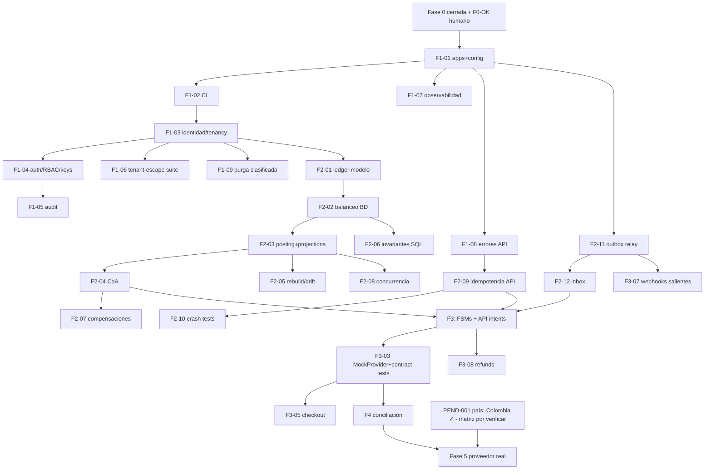

# Backlog priorizado

Estado: Activo · Fuente única de trabajo · Formato §48: cada ítem lleva ID, dominio, dependencias, riesgo, criterios de aceptación (CA), pruebas y talla. Prioridades: P0 = siguiente fase ejecutable, P1, P2, P3, Futuro.

## P0 — Cierre de Fase 0 + Fase 1 (Fundación)

| ID | Título | Dominio | Deps | Riesgo | Talla | CA / Pruebas | Estado |
|----|--------|---------|------|--------|-------|--------------|--------|
| F0-VER | Verificar licencias/mantenimiento de referencias en vivo | Gobernanza | acceso a repos | Bajo | XS | Matriz actualizada con licencia verificada + fecha | Pendiente (bloqueado por red de esta sesión) |
| F0-OK | Revisión humana del paquete de Fase 0 | Gobernanza | — | — | S | Propietario aprueba decisiones y ADRs | **Completado 2026-07-04** (Fase 0 aprobada; país = Colombia) |
| F1-01 | Estructura de apps (`apps/api`, `apps/worker`) + config por entorno tipada | Plataforma | F0-OK | Bajo | S | App Fastify arranca con health/readiness; config Zod-validada falla rápido | **Completado 2026-07-04** (46 tests verdes + smoke test) |
| F1-02 | CI completo: install reproducible, lint, typecheck, unit, integración con PG real, secret/dependency scanning, SBOM | Plataforma | F1-01 | Medio | M | Pipeline verde requerido para merge; migration dry-run incluido | **Completado 2026-07-04** (workflow publicado; Redis se añade al pipeline cuando exista consumidor real) |
| F1-03 | Modelo identidad/tenancy: organizations, merchants, users, memberships (migra el `tenants` del spike) | Identidad | F1-02 | Alto | L | CRUD con RLS; migración expand-contract desde spike; tests de integración | **Completado 2026-07-04** (migración 0003 + @fluvia/identity, 15 tests de integración) |
| F1-04 | Auth: registro, verificación email, login, MFA TOTP, sesiones revocables, RBAC, API keys con scopes | Identidad | F1-03 | Alto | XL | Suite authN/authZ + BOLA por endpoint; step-up para acciones sensibles | **Parcial**: (a) completada — registro/login/lockout/sesiones+rol fluvia_auth; (c) completada 2026-07-04 — API keys con scopes+entorno (secreto una sola vez), RBAC declarativo por endpoint, endpoints de organizations/merchants/api-keys y /v1/account, con tests BOLA y de planos no intercambiables. Pendiente SOLO (b) MFA TOTP + step-up |
| F1-05 | Audit log append-only + access matrix | Seguridad | F1-04 | Medio | M | Acciones sensibles auditadas con actor/razón; matriz publicada | **Completado 2026-07-04** (migración 0006 + @fluvia/audit; auditoría atómica con la acción; matriz publicada en F1-04c y ampliada con audit:read) |
| F1-06 | Suite ampliada de tenant-escape + bypass administrativo controlado | Seguridad | F1-03 | Alto | M | Gate Multi-tenant técnico en verde | Pendiente |
| F1-07 | Observabilidad base: pino+correlation, OTel, métricas, tablero | Plataforma | F1-01 | Medio | M | Trazas extremo a extremo en local; alertas baseline | Pendiente |
| F1-08 | Taxonomía de errores de API + formato estable + Request-Id | API | F1-01 | Medio | S | Catálogo versionado; errores legibles por máquina; tests de contrato | Pendiente |
| F1-09 | Política de purga por clasificación de datos (relajar DELETE en `idempotency_keys`/sesiones vía job auditado) | Datos | F1-03 | Medio | S | Purga solo por job con auditoría; triggers intactos en clases financieras | Pendiente |
| F1-10 | Seeds deterministas por entorno + datos de demo | Plataforma | F1-03 | Bajo | S | `pnpm seed` reproducible; staging sin datos reales | Pendiente |

## P1 — Fase 2 (Núcleo financiero)

| ID | Título | Deps | Riesgo | Talla | CA / Pruebas |
|----|--------|------|--------|-------|--------------|
| F2-01 | `ledger_transactions` con source causal + `reverses_tx_id`; promover `@fluvia/money` del spike | F1-03 | Alto | M | Modelo final migrado; money tests portados |
| F2-02 | Constraint trigger diferido: balanceo por (tx, moneda) | F2-01 | Alto | S | Asiento desbalanceado imposible aun con SQL manual (test negativo) |
| F2-03 | `balance_projections` versionada separada + `LedgerService.postTransaction` (locking ordenado, retry limitado) | F2-02 | Alto | L | Posting normativo de `ledger-design.md` §5 con tests de integración |
| F2-04 | Chart of Accounts + reglas de posting con golden tests | F2-03 | Alto | M | Catálogo en código == doc; combinaciones fuera de catálogo rechazadas |
| F2-05 | Rebuild de proyecciones + drift check programado | F2-03 | Alto | M | rebuild == proyección (property test); alerta de drift |
| F2-06 | `scripts/verify-ledger-invariants.sql` externo al ORM + integración CI | F2-02 | Medio | S | Corre en CI y por cron; detecta corrupción sembrada en test |
| F2-07 | Compensaciones/reversals | F2-04 | Alto | M | Reversal referencia original; suma neta correcta; auditoría |
| F2-08 | Suite de concurrencia del ledger (postings concurrentes, lock ordering, deadlock retry) | F2-03 | Alto | M | Gate Ledger concurrencia verde; baseline reproducible documentada |
| F2-09 | Capa de idempotencia API (`idempotency_keys` + contrato de `idempotency.md`) | F1-08 | Alto | M | Los 5 casos del contrato con tests; carrera N→1 |
| F2-10 | Pruebas de crash-recovery de idempotencia (kill pre/post COMMIT) | F2-09 | Alto | S | Gate Idempotencia verde |
| F2-11 | Outbox relay worker (`SKIP LOCKED`, backoff+jitter, DLQ, replay auditado) | F1-01 | Alto | M | Sin doble entrega con 2 workers; poison → dead + métrica |
| F2-12 | Inbox `provider_events` (dedup, raw, verificación, DLQ Zod) | F2-11 | Alto | M | Duplicados → 1 procesamiento; fuera de orden manejado |

## P2 — Fase 3 (Sandbox de pagos)

F3-01 FSMs declarativas (intent/attempt/refund) + servicio de transiciones · F3-02 API `/v1/payment_intents` + customers (idempotente, OpenAPI) · F3-03 MockPaymentProvider (tokenización simulada, eventos asíncronos, fallas inyectables) + contract tests del adapter · F3-04 Circuit breaker + timeouts + política de indeterminado · F3-05 Checkout session app (Next.js, i18n es/en, WCAG AA) · F3-06 Payment links · F3-07 Webhooks salientes (motor + SSRF guard + rotación) · F3-08 Refunds E2E con ledger compensatorio · F3-09 Dashboard mínimo · F3-10 SDK TS generado de OpenAPI.

## P3 — Fase 4 (Conciliación y operaciones)

F4-01 Reportes del MockProvider con discrepancias inyectables · F4-02 Motor de conciliación batch + continua · F4-03 Casos operativos con four-eyes · F4-04 Panel admin · F4-05 Abstracciones fees/reserves/settlement/payout (contables, bloqueadas) · F4-06 Runbooks + drills.

## Futuro (no planificar aún)

Proveedor real (Fase 5 — país ya decidido: Colombia; bloqueada por la verificación legal de la matriz de jurisdicción), hardening (Fase 6), production readiness (Fase 7), disputas completas, billing (ver Lago), multi-país.

## DAG

Regla §49 respetada: idempotencia (F2-09) precede a la exposición de la API financiera mutante (F3-02).
