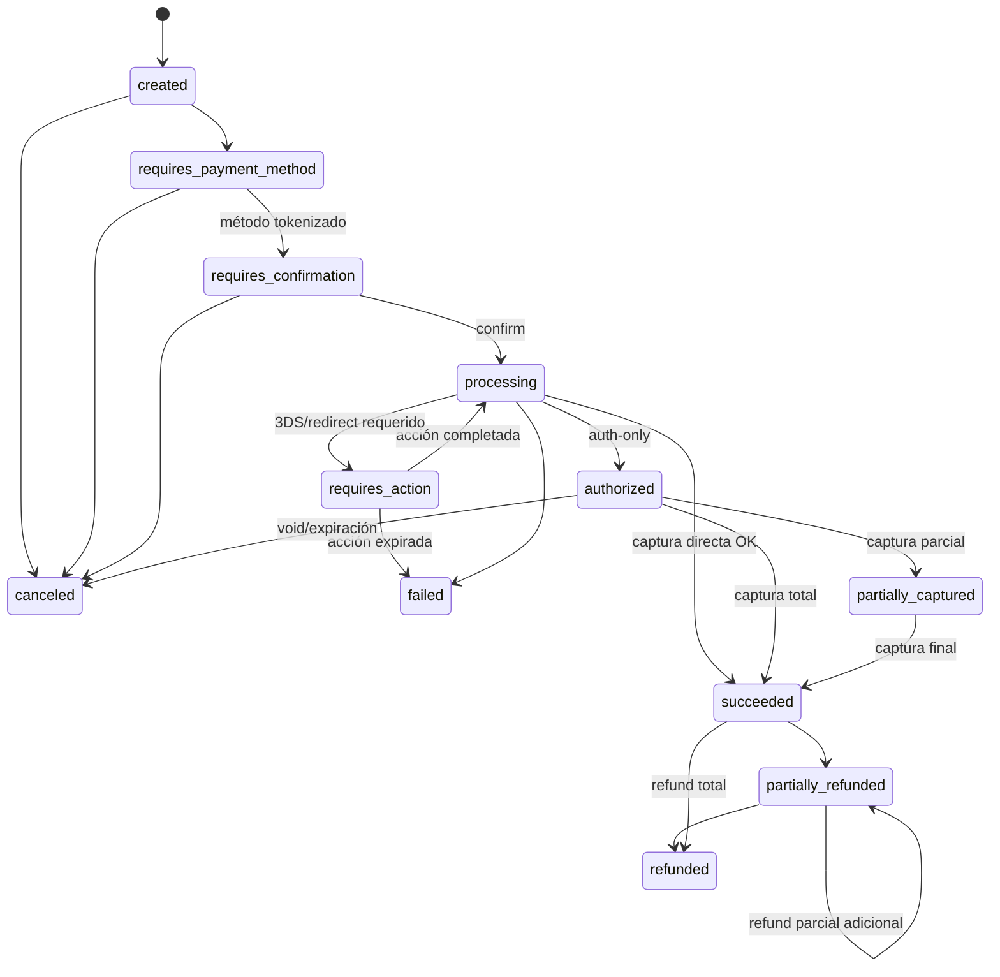

# Máquinas de estado de pagos

Estado: Activo · Fase: 0 · Este documento debe mapear EXACTAMENTE con el código (`packages/payments-core/src/fsm/*`); todo PR que toque una FSM actualiza ambos.

> **Estado de implementación (AUD-P3-002, 2026-07-04): DISEÑO — nada construido.** `packages/payments-core` aún no existe; ninguna FSM está implementada. La regla de mapeo doc↔código aplica desde el momento en que ese paquete se cree (F3).

## 1. Payment Intent

Estados: `created`, `requires_payment_method`, `requires_confirmation`, `requires_action`, `processing`, `authorized`, `partially_captured`, `succeeded`, `failed`, `canceled`, `partially_refunded`, `refunded`.

Terminales: `failed`, `canceled`, `refunded`. Nota: `failed` del intent es terminal; el **reintento** se modela creando un nuevo attempt desde `requires_confirmation`/`processing` según método — el intent solo pasa a `failed` cuando la política de reintentos se agota o el fallo es definitivo.

## 2. Payment Attempt (uno por intento real contra el proveedor)

Estados: `created`, `submitting`, `submitted`, `requires_action`, `indeterminate`, `succeeded`, `failed`, `expired`.

Transiciones clave: `submitting → indeterminate` en timeout ambiguo (V4 §23); `indeterminate → succeeded|failed` solo por consulta al proveedor, webhook o conciliación — nunca por asunción. `indeterminate` genera alerta si envejece más del umbral (Nivel C).

## 3. Refund

Estados: `created`, `processing`, `succeeded`, `failed`, `canceled` (si el proveedor lo permite).

Invariantes: `Σ refunds no-fallidos ≤ monto capturado` (servicio + property test); todo `succeeded` publica asiento compensatorio en la misma unidad de consistencia; idempotencia por `(tenant, refund idempotency key)`.

## 4. Dispute (modelo presente, programa fuera del MVP)

`created → needs_response → under_review → won | lost → closed`, con `evidence`, `deadline`, impacto contable vía `dispute.reserve`. Relación N:1 con el pago; no muta el estado del intent — el intent refleja disputas mediante campo derivado/flag, no cambiando su FSM.

## 5. Checkout Session

`open → completed | expired | canceled`. `completed` requiere intent en estado post-confirmación. Expiración por TTL (Nivel C). Protección de doble submit: la confirmación es idempotente por sesión.

## 6. Settlement / Payout (abstracciones en Fase 4)

Settlement: `open → closing → settled`. Payout: `created → processing → succeeded | failed`, con `payout.in_transit` contable. Payouts reales bloqueados hasta gates aplicables (Nivel A).

## 7. Implementación normativa

- Cada FSM es una tabla de transiciones **declarativa** (`Record<Estado, Estado[]>`) exportada por el paquete de dominio; los tests recorren la matriz completa (permitidas pasan, el resto lanza `InvalidStateTransitionError`).
- Transición = función del servicio de dominio: `FOR UPDATE` + guard de `version`, evento outbox y auditoría en la misma transacción.
- Los diagramas de este documento se regeneran desde la tabla de transiciones (script en F3) para impedir divergencia doc/código.
