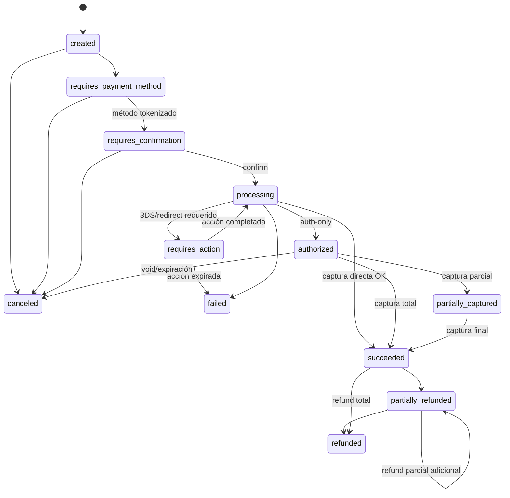
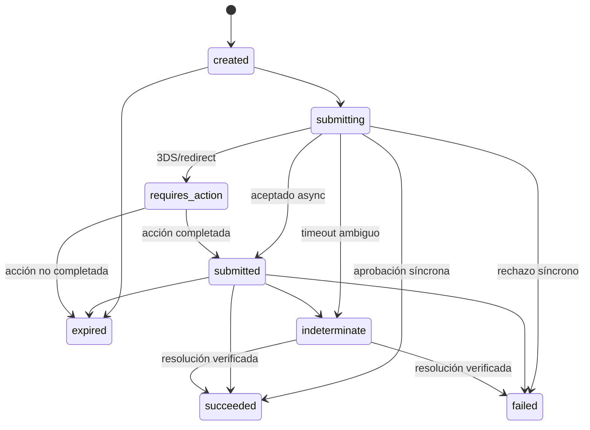
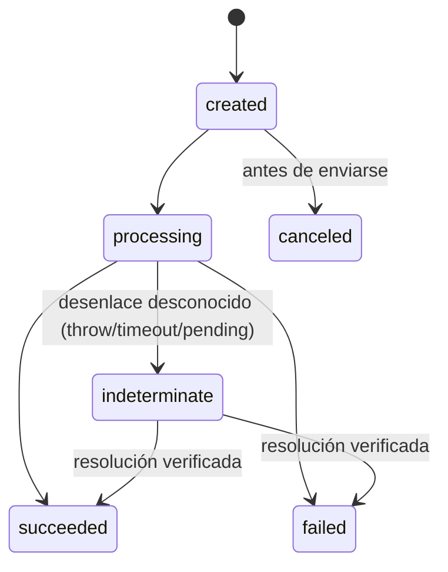
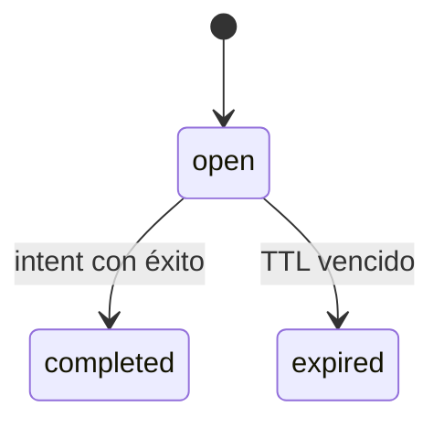

# Máquinas de estado de pagos

Estado: Activo · Fase: 0 · Este documento debe mapear EXACTAMENTE con el código (`packages/payments-core/src/fsm/*`); todo PR que toque una FSM actualiza ambos.

> **Estado de implementación (2026-07-05, F3-08): FSMs de intent/attempt/refund IMPLEMENTADAS Y HECHAS CUMPLIR EN EL MOTOR** en `@fluvia/payments-core` (mapas declarativos) y en la base (tablas `payment_intent_transitions`/`payment_attempt_transitions` de la migración 0017; `refund_transitions` de la 0020) con triggers de validación. Un meta-test exige igualdad exacta entre los mermaid de este doc, los mapas TS y las tablas de la base, y prueba la matriz completa de transiciones ilegales con SQL de superusuario (144 intent + 64 attempt + 25 refund pares). Refunds end-to-end operativos (F3-08): asiento compensatorio por la vía normativa, con webhooks `refund.*` al comercio. Checkout, providers reales y disputas siguen sin construir.

## 1. Payment Intent

Estados: `created`, `requires_payment_method`, `requires_confirmation`, `requires_action`, `processing`, `authorized`, `partially_captured`, `succeeded`, `failed`, `canceled`, `partially_refunded`, `refunded`.

Terminales: `failed`, `canceled`, `refunded`. Nota: `failed` del intent es terminal; el **reintento** se modela creando un nuevo attempt desde `requires_confirmation`/`processing` según método — el intent solo pasa a `failed` cuando la política de reintentos se agota o el fallo es definitivo.

## 2. Payment Attempt (uno por intento real contra el proveedor)

Estados: `created`, `submitting`, `submitted`, `requires_action`, `indeterminate`, `succeeded`, `failed`, `expired`.

Terminales: `succeeded`, `failed`, `expired`. Transiciones clave: `submitting → indeterminate` en timeout ambiguo (V4 §23); `indeterminate → succeeded|failed` solo por consulta al proveedor, webhook o conciliación — nunca por asunción. `indeterminate` genera alerta si envejece más del umbral (Nivel C).

## 3. Refund

Estados: `created`, `processing`, `indeterminate`, `succeeded`, `failed`, `canceled` (si el proveedor lo permite).

Invariantes: `Σ refunds no-fallidos ≤ monto capturado` (servicio + property test); todo `succeeded` publica asiento compensatorio en la misma unidad de consistencia; idempotencia por `(tenant, refund idempotency key)`. `indeterminate` (V4 §23, igual que attempts): tras llamar al proveedor con desenlace desconocido (throw/timeout) o aceptación asíncrona (`pending`), la reserva contable queda RETENIDA y SOLO una fuente verificada — webhook, consulta o conciliación — lo cierra (`resolveFromProvider`); jamás por asunción ni re-envío.

## 4. Dispute (modelo presente, programa fuera del MVP)

`created → needs_response → under_review → won | lost → closed`, con `evidence`, `deadline`, impacto contable vía `dispute.reserve`. Relación N:1 con el pago; no muta el estado del intent — el intent refleja disputas mediante campo derivado/flag, no cambiando su FSM.

## 5. Checkout Session

Estados: `open`, `completed`, `expired`.

`completed` cuando el payment intent asociado tiene éxito; `expired` por TTL (Nivel C, default 24 h). Un comprador que cancela se redirige a `cancel_url` pero la sesión sigue `open` hasta expirar (puede reintentar) — no hay estado `canceled` explícito. Protección de doble submit: la confirmación es idempotente por sesión. Terminales: `completed`, `expired`. FSM hecha cumplir EN el motor (migración 0022); el disparo de completed/expired y sus eventos `checkout_session.*` llegan con el flujo alojado (F3-05c).

## 6. Settlement / Payout (abstracciones en Fase 4)

Settlement: `open → closing → settled`. Payout: `created → processing → succeeded | failed`, con `payout.in_transit` contable. Payouts reales bloqueados hasta gates aplicables (Nivel A).

## 7. Implementación normativa

- Cada FSM es una tabla de transiciones **declarativa** (`Record<Estado, Estado[]>`) exportada por el paquete de dominio; los tests recorren la matriz completa (permitidas pasan, el resto lanza `InvalidStateTransitionError`).
- Transición = función del servicio de dominio: `FOR UPDATE` + guard de `version`, evento outbox y auditoría en la misma transacción.
- Los diagramas de este documento se regeneran desde la tabla de transiciones (script en F3) para impedir divergencia doc/código.
