# Imágenes de productos de demostración

Conjunto **cerrado** servido por el dashboard y el checkout en `/catalog/<archivo>.jpg` (fuente de verdad: `packages/commerce/src/demo-images.ts`; la API solo acepta estas referencias y la base de datos solo admite `catalog/<nombre>.jpg`).

- **Licencia**: solo CC0 1.0 (la política del repo admite `CC0-1.0`; `CC-BY-*` requiere decisión humana). Comprobada en la página de **origen** el 2026-10-01: Flickr expone el id de licencia `9` (= CC0 1.0); StockSnap muestra «CC0 License».
- **Descartadas**: las de rawpixel (la página de origen devolvió 403: no se pudo verificar), una de Flickr con 404 y una marcada «Public Domain Mark» (no es CC0).
- **Tiendas Fluvia (2026-10-03)**: las 15 `catalog/tienda-*.jpg` siguen la misma regla (CC0 verificada en la página de origen vía Openverse). Productos recortados a 640×800 (4:5) y portadas a 1024×576; se descartaron candidatas con marcas (auriculares, tecla de Windows), personas identificables o piezas de museo dudosas.
- **Tratamiento**: recorte cuadrado 480×480, JPEG q72, metadatos eliminados. `originalSha256` (en el TS) es la huella del archivo original descargado.
- **Sin marcas visibles** como criterio de selección; los productos sin foto adecuada (arroz, harina, aceite, detergente, jabón) muestran un marcador diseñado, no una foto engañosa.
- **Por qué no URLs externas**: la CSP de ambas apps es `img-src 'self'` y subir imágenes requiere almacenamiento, no autorizado en esta jornada.

| Vista                                                                                               | Referencia                           | Título original                                           | Autor                    | Origen                                                             | Licencia                                                      | Verificación                                                                |
| --------------------------------------------------------------------------------------------------- | ------------------------------------ | --------------------------------------------------------- | ------------------------ | ------------------------------------------------------------------ | ------------------------------------------------------------- | --------------------------------------------------------------------------- |
|                                    | `catalog/agua.jpg`                   | Plastic PET Water Bottles: Empty, Full, Cold              | qubodup                  | [flickr](https://www.flickr.com/photos/21051491@N02/7803156280)    | [CC0 1.0](https://creativecommons.org/publicdomain/zero/1.0/) | flickr license id 9 = CC0 1.0                                               |
|                        | `catalog/boligrafos.jpg`             | Office Work                                               | Jeffrey Betts            | [stocksnap](https://stocksnap.io/photo/office-work-91WZ32J28K)     | [CC0 1.0](https://creativecommons.org/publicdomain/zero/1.0/) | stocksnap page (2026-10-01): CC0 License, enlace publicdomain/zero/1.0      |
|                                 | `catalog/cafe-grano.jpg`             | Coffee Beans                                              | megforce1                | [flickr](https://www.flickr.com/photos/35608308@N05/22247100615)   | [CC0 1.0](https://creativecommons.org/publicdomain/zero/1.0/) | flickr license id 9 = CC0 1.0                                               |
|                                | `catalog/cuaderno.jpg`               | Notebook Paper                                            | Dana Marin               | [stocksnap](https://stocksnap.io/photo/notebook-paper-DXP038JQNB)  | [CC0 1.0](https://creativecommons.org/publicdomain/zero/1.0/) | stocksnap page (2026-10-01): CC0 License, enlace publicdomain/zero/1.0      |
|                                  | `catalog/huevos.jpg`                 | Fresh Eggs                                                | cogdogblog               | [flickr](https://www.flickr.com/photos/37996646802@N01/2543297739) | [CC0 1.0](https://creativecommons.org/publicdomain/zero/1.0/) | flickr license id 9 = CC0 1.0                                               |
|                             | `catalog/jugo-naranja.jpg`           | drink-breakfast-orange-juice                              | pixellaphoto             | [flickr](https://www.flickr.com/photos/137643065@N06/23958994069)  | [CC0 1.0](https://creativecommons.org/publicdomain/zero/1.0/) | flickr license id 9 = CC0 1.0                                               |
|                                        | `catalog/pan.jpg`                    | Bread made in the country                                 | Isaszas                  | [flickr](https://www.flickr.com/photos/87805257@N00/29640323016)   | [CC0 1.0](https://creativecommons.org/publicdomain/zero/1.0/) | flickr license id 9 = CC0 1.0                                               |
|                                        | `catalog/platanos.jpg`               | Plantain bananas: Mechanical bruising injury to peels     | Plant pests and diseases | [flickr](https://www.flickr.com/photos/62295966@N07/37515979381)   | [CC0 1.0](https://creativecommons.org/publicdomain/zero/1.0/) | flickr license id 9 = CC0 1.0                                               |
|                                    | `catalog/queso.jpg`                  | Cheese, Wine and Bread.                                   | Mustang Joe              | [flickr](https://www.flickr.com/photos/63234672@N04/19757310168)   | [CC0 1.0](https://creativecommons.org/publicdomain/zero/1.0/) | flickr license id 9 = CC0 1.0                                               |
|                                        | `catalog/refresco.jpg`               | Raspberry lemonade on a wooden table. Iced summer drink.  | Artem Beliaikin          | [flickr](https://www.flickr.com/photos/157635012@N07/43108065435)  | [CC0 1.0](https://creativecommons.org/publicdomain/zero/1.0/) | flickr license id 9 = CC0 1.0                                               |
| 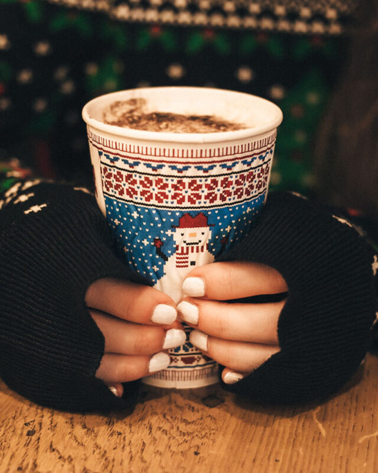   | `catalog/tienda-taza-ceramica.jpg`   | Girl holding christmas coffee cup                         | freestocks.org           | [flickr](https://www.flickr.com/photos/135396164@N05/31164821320)  | [CC0 1.0](https://creativecommons.org/publicdomain/zero/1.0/) | flickr license id 9 = CC0 1.0 (página de origen, 2026-10-03; vía Openverse) |
| 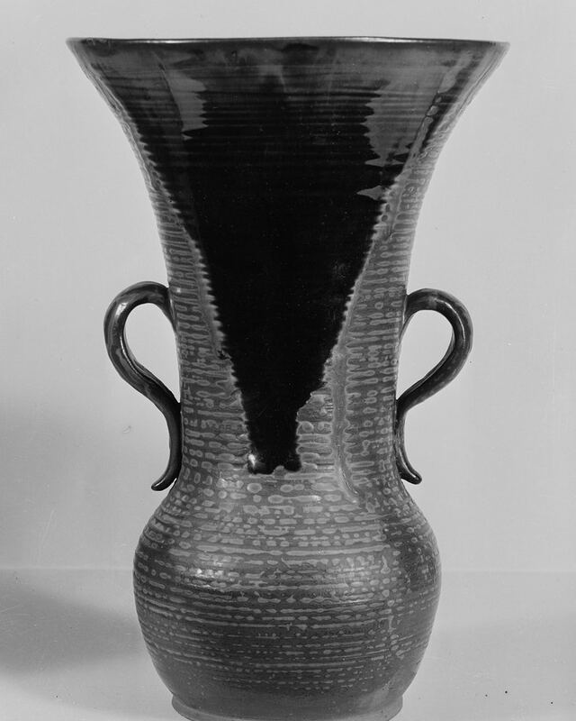              | `catalog/tienda-jarron-barro.jpg`    | Vase \| ca. 1750                                          | museado                  | [flickr](https://www.flickr.com/photos/200781279@N05/53909893585)  | [CC0 1.0](https://creativecommons.org/publicdomain/zero/1.0/) | flickr license id 9 = CC0 1.0 (página de origen, 2026-10-03; vía Openverse) |
| 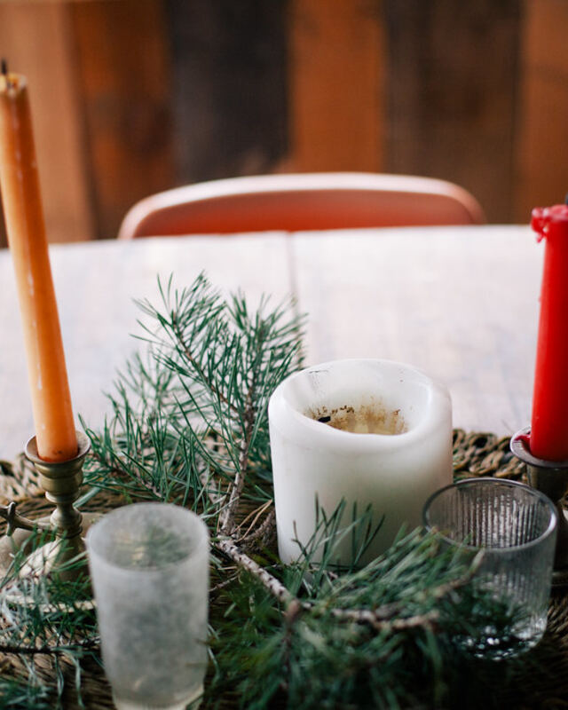            | `catalog/tienda-velas.jpg`           | Table with Candles                                        | Image Catalog            | [flickr](https://www.flickr.com/photos/132795455@N08/24682244594)  | [CC0 1.0](https://creativecommons.org/publicdomain/zero/1.0/) | flickr license id 9 = CC0 1.0 (página de origen, 2026-10-03; vía Openverse) |
| 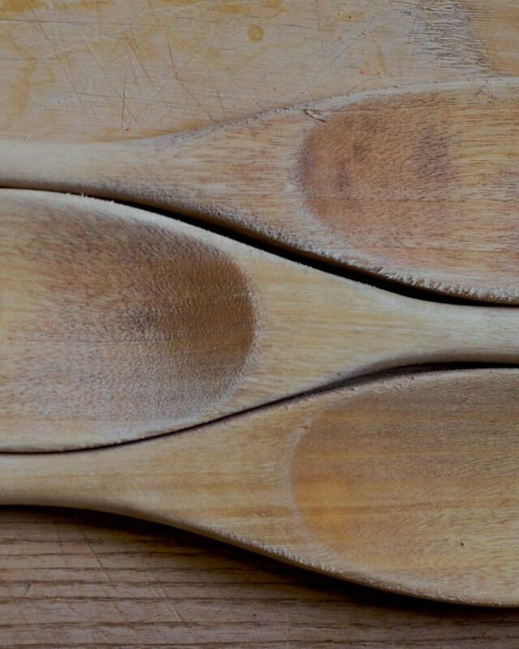               | `catalog/tienda-cucharas-madera.jpg` | Three Spoons                                              | cogdogblog               | [flickr](https://www.flickr.com/photos/37996646802@N01/4420870927) | [CC0 1.0](https://creativecommons.org/publicdomain/zero/1.0/) | flickr license id 9 = CC0 1.0 (página de origen, 2026-10-03; vía Openverse) |
| 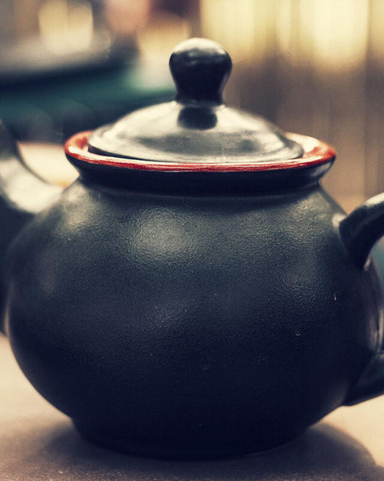                      | `catalog/tienda-tetera.jpg`          | Black Ceramic Teapot                                      | Image Catalog            | [flickr](https://www.flickr.com/photos/132795455@N08/17106495329)  | [CC0 1.0](https://creativecommons.org/publicdomain/zero/1.0/) | flickr license id 9 = CC0 1.0 (página de origen, 2026-10-03; vía Openverse) |
| 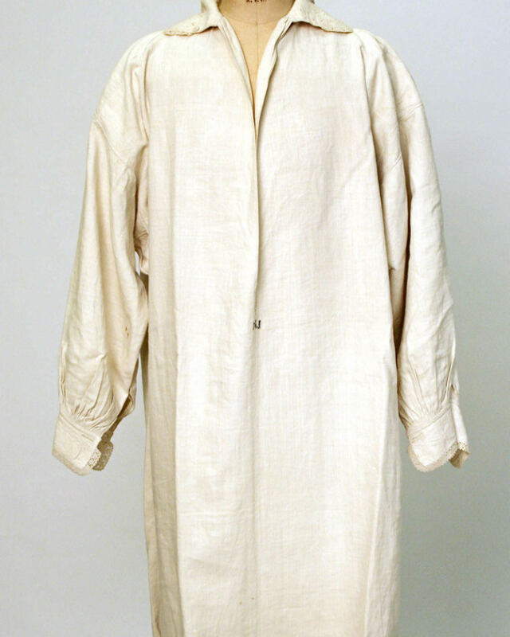      | `catalog/tienda-camisa-lino.jpg`     | Shirt \| 19th century                                     | museado                  | [flickr](https://www.flickr.com/photos/200781279@N05/53910451743)  | [CC0 1.0](https://creativecommons.org/publicdomain/zero/1.0/) | flickr license id 9 = CC0 1.0 (página de origen, 2026-10-03; vía Openverse) |
| 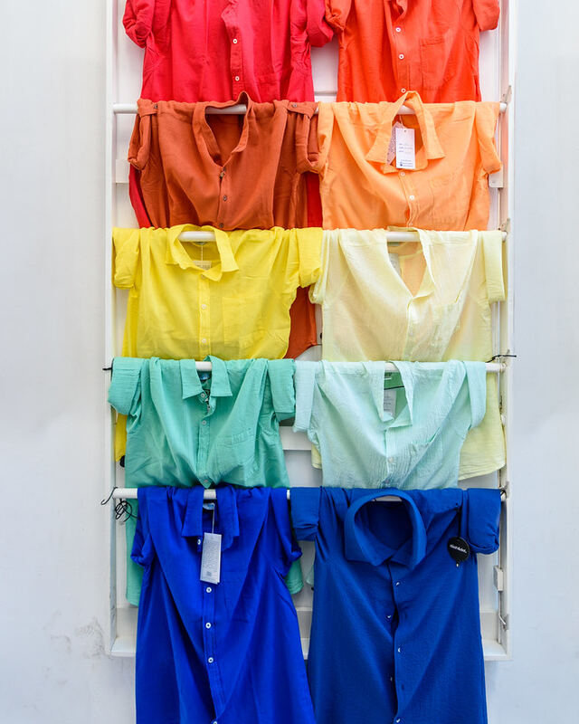 | `catalog/tienda-camisas-color.jpg`   | Pick a colour                                             | Mustang Joe              | [flickr](https://www.flickr.com/photos/63234672@N04/53837731684)   | [CC0 1.0](https://creativecommons.org/publicdomain/zero/1.0/) | flickr license id 9 = CC0 1.0 (página de origen, 2026-10-03; vía Openverse) |
| 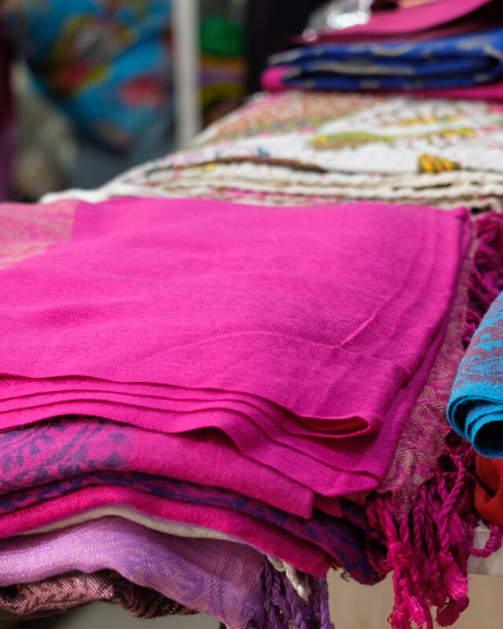            | `catalog/tienda-panuelos.jpg`        | Silk Scarfs                                               | MyStockPhotos            | [flickr](https://www.flickr.com/photos/136375272@N05/47212910452)  | [CC0 1.0](https://creativecommons.org/publicdomain/zero/1.0/) | flickr license id 9 = CC0 1.0 (página de origen, 2026-10-03; vía Openverse) |
| 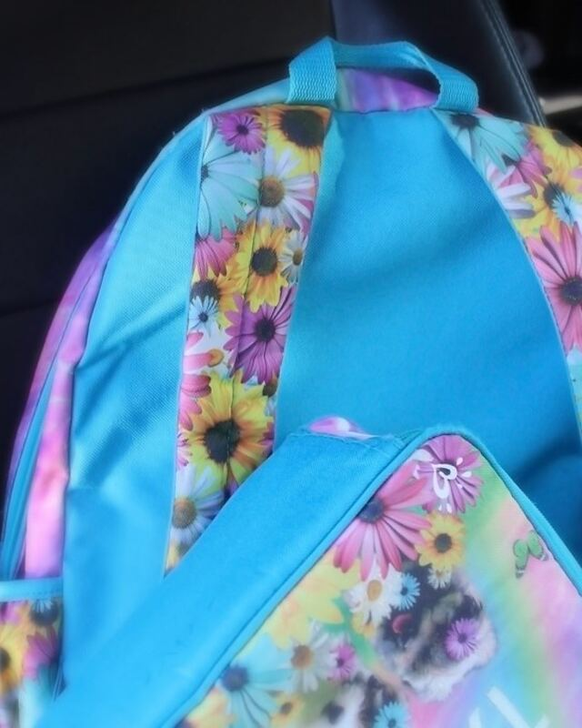      | `catalog/tienda-mochila-floral.jpg`  | Backpack                                                  | megforce1                | [flickr](https://www.flickr.com/photos/35608308@N05/28404475294)   | [CC0 1.0](https://creativecommons.org/publicdomain/zero/1.0/) | flickr license id 9 = CC0 1.0 (página de origen, 2026-10-03; vía Openverse) |
| 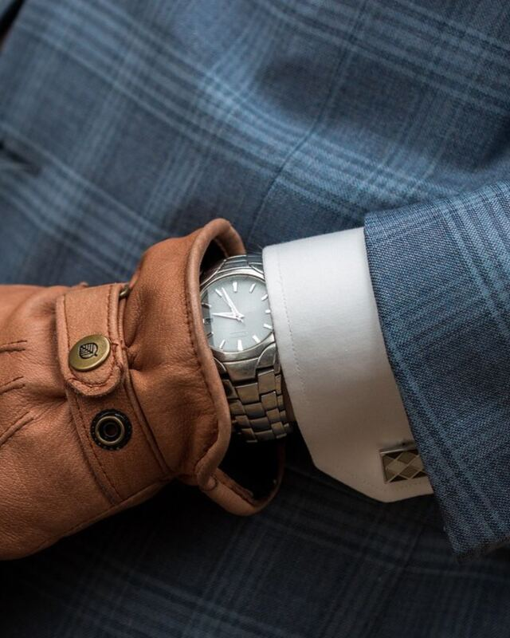           | `catalog/tienda-guantes-cuero.jpg`   | Glove and wrist watch                                     | Wallboat                 | [flickr](https://www.flickr.com/photos/151415985@N06/36113831143)  | [CC0 1.0](https://creativecommons.org/publicdomain/zero/1.0/) | flickr license id 9 = CC0 1.0 (página de origen, 2026-10-03; vía Openverse) |
|                      | `catalog/tienda-teclado.jpg`         | Keys on a Keyboard                                        | Image Catalog            | [flickr](https://www.flickr.com/photos/132795455@N08/17596421283)  | [CC0 1.0](https://creativecommons.org/publicdomain/zero/1.0/) | flickr license id 9 = CC0 1.0 (página de origen, 2026-10-03; vía Openverse) |
|        | `catalog/tienda-lampara.jpg`         | Metal desk lamp and books pile                            | freestocks.org           | [flickr](https://www.flickr.com/photos/135396164@N05/42381074432)  | [CC0 1.0](https://creativecommons.org/publicdomain/zero/1.0/) | flickr license id 9 = CC0 1.0 (página de origen, 2026-10-03; vía Openverse) |
| 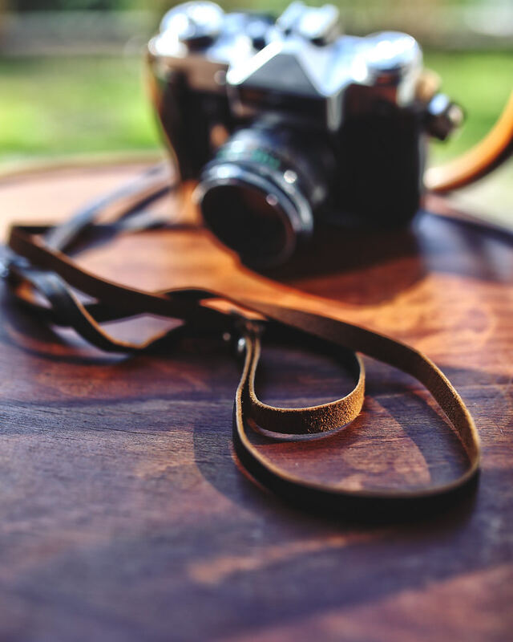           | `catalog/tienda-camara.jpg`          | camera-vintage-wooden-old                                 | pixellaphoto             | [flickr](https://www.flickr.com/photos/137643065@N06/24243490551)  | [CC0 1.0](https://creativecommons.org/publicdomain/zero/1.0/) | flickr license id 9 = CC0 1.0 (página de origen, 2026-10-03; vía Openverse) |
| 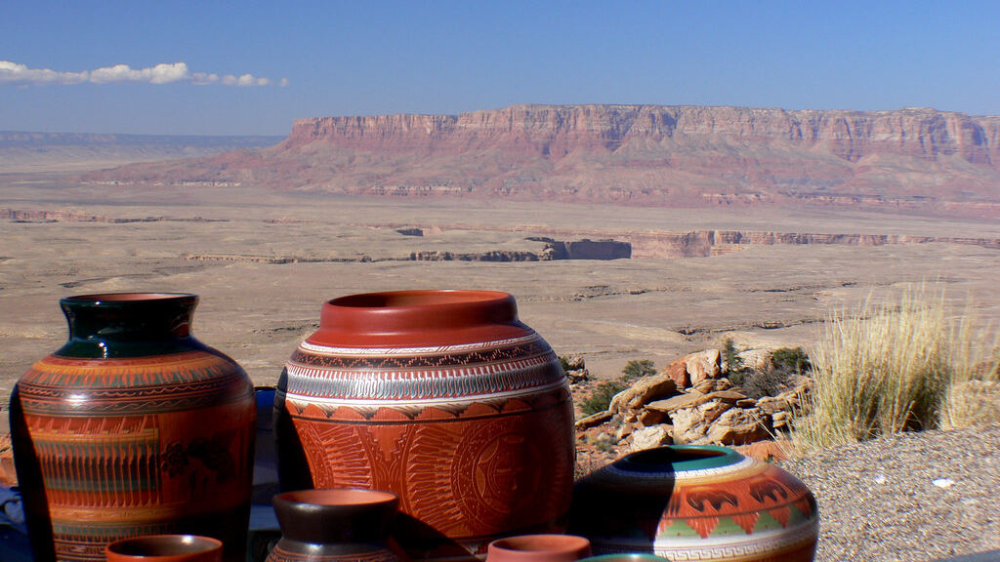    | `catalog/tienda-banner-hogar.jpg`    | Navajo Pottery.                                           | Bernard Spragg           | [flickr](https://www.flickr.com/photos/88123769@N02/14768170768)   | [CC0 1.0](https://creativecommons.org/publicdomain/zero/1.0/) | flickr license id 9 = CC0 1.0 (página de origen, 2026-10-03; vía Openverse) |
| 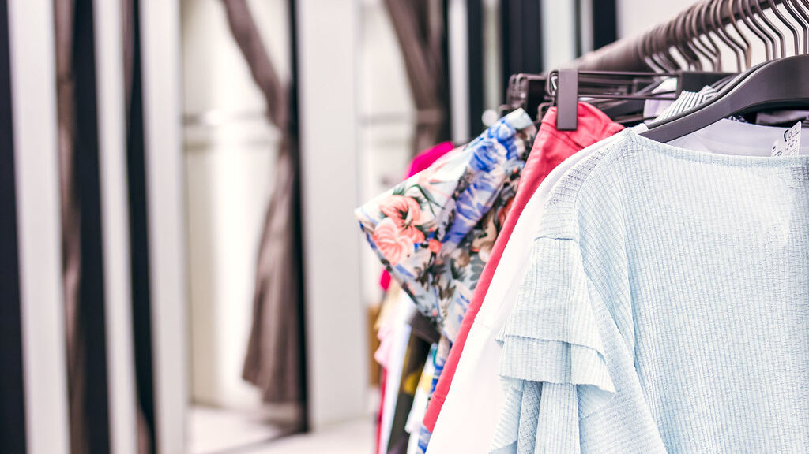                    | `catalog/tienda-banner-moda.jpg`     | Woman clothes in the store. Fashion store. Shopping mall. | Artem Beliaikin          | [flickr](https://www.flickr.com/photos/157635012@N07/49174901528)  | [CC0 1.0](https://creativecommons.org/publicdomain/zero/1.0/) | flickr license id 9 = CC0 1.0 (página de origen, 2026-10-03; vía Openverse) |
