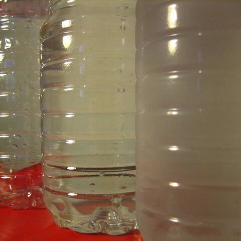
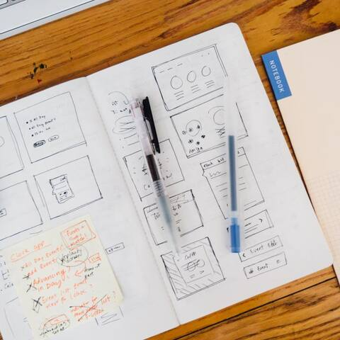
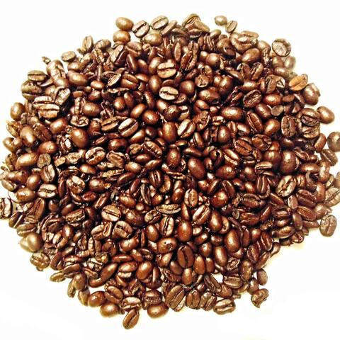
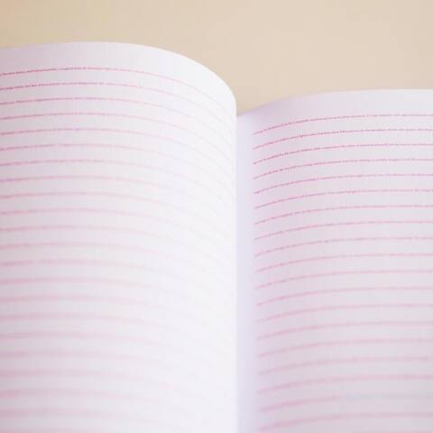
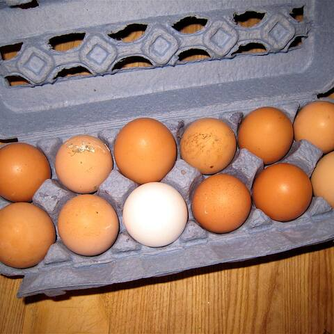
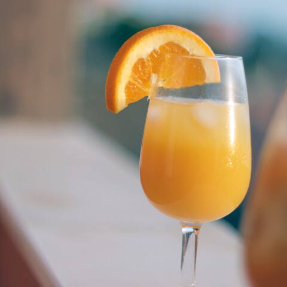
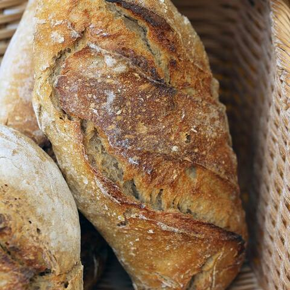
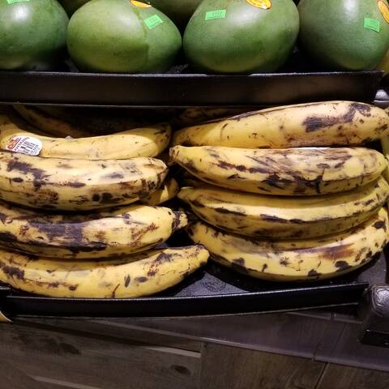
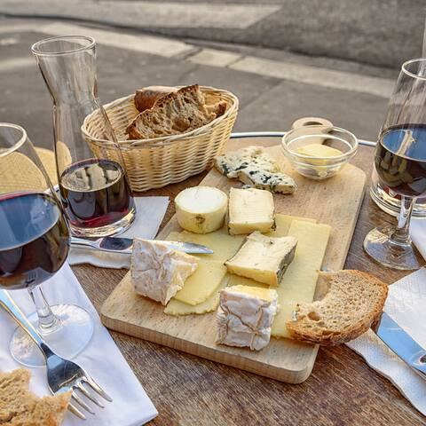
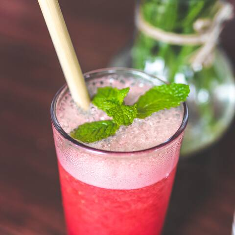

# Imágenes de productos de demostración

Conjunto **cerrado** servido por el dashboard y el checkout en `/catalog/<archivo>.jpg` (fuente de verdad: `packages/commerce/src/demo-images.ts`; la API solo acepta estas referencias y la base de datos solo admite `catalog/<nombre>.jpg`).

- **Licencia**: solo CC0 1.0 (la política del repo admite `CC0-1.0`; `CC-BY-*` requiere decisión humana). Comprobada en la página de **origen** el 2026-10-01: Flickr expone el id de licencia `9` (= CC0 1.0); StockSnap muestra «CC0 License».
- **Descartadas**: las de rawpixel (la página de origen devolvió 403: no se pudo verificar), una de Flickr con 404 y una marcada «Public Domain Mark» (no es CC0).
- **Tratamiento**: recorte cuadrado 480×480, JPEG q72, metadatos eliminados. `originalSha256` (en el TS) es la huella del archivo original descargado.
- **Sin marcas visibles** como criterio de selección; los productos sin foto adecuada (arroz, harina, aceite, detergente, jabón) muestran un marcador diseñado, no una foto engañosa.
- **Por qué no URLs externas**: la CSP de ambas apps es `img-src 'self'` y subir imágenes requiere almacenamiento, no autorizado en esta jornada.

| Vista                                                                         | Referencia                 | Título original                                          | Autor                    | Origen                                                             | Licencia                                                      | Verificación                                                           |
| ----------------------------------------------------------------------------- | -------------------------- | -------------------------------------------------------- | ------------------------ | ------------------------------------------------------------------ | ------------------------------------------------------------- | ---------------------------------------------------------------------- |
|              | `catalog/agua.jpg`         | Plastic PET Water Bottles: Empty, Full, Cold             | qubodup                  | [flickr](https://www.flickr.com/photos/21051491@N02/7803156280)    | [CC0 1.0](https://creativecommons.org/publicdomain/zero/1.0/) | flickr license id 9 = CC0 1.0                                          |
|  | `catalog/boligrafos.jpg`   | Office Work                                              | Jeffrey Betts            | [stocksnap](https://stocksnap.io/photo/office-work-91WZ32J28K)     | [CC0 1.0](https://creativecommons.org/publicdomain/zero/1.0/) | stocksnap page (2026-10-01): CC0 License, enlace publicdomain/zero/1.0 |
|           | `catalog/cafe-grano.jpg`   | Coffee Beans                                             | megforce1                | [flickr](https://www.flickr.com/photos/35608308@N05/22247100615)   | [CC0 1.0](https://creativecommons.org/publicdomain/zero/1.0/) | flickr license id 9 = CC0 1.0                                          |
|          | `catalog/cuaderno.jpg`     | Notebook Paper                                           | Dana Marin               | [stocksnap](https://stocksnap.io/photo/notebook-paper-DXP038JQNB)  | [CC0 1.0](https://creativecommons.org/publicdomain/zero/1.0/) | stocksnap page (2026-10-01): CC0 License, enlace publicdomain/zero/1.0 |
|            | `catalog/huevos.jpg`       | Fresh Eggs                                               | cogdogblog               | [flickr](https://www.flickr.com/photos/37996646802@N01/2543297739) | [CC0 1.0](https://creativecommons.org/publicdomain/zero/1.0/) | flickr license id 9 = CC0 1.0                                          |
|       | `catalog/jugo-naranja.jpg` | drink-breakfast-orange-juice                             | pixellaphoto             | [flickr](https://www.flickr.com/photos/137643065@N06/23958994069)  | [CC0 1.0](https://creativecommons.org/publicdomain/zero/1.0/) | flickr license id 9 = CC0 1.0                                          |
|                  | `catalog/pan.jpg`          | Bread made in the country                                | Isaszas                  | [flickr](https://www.flickr.com/photos/87805257@N00/29640323016)   | [CC0 1.0](https://creativecommons.org/publicdomain/zero/1.0/) | flickr license id 9 = CC0 1.0                                          |
|                  | `catalog/platanos.jpg`     | Plantain bananas: Mechanical bruising injury to peels    | Plant pests and diseases | [flickr](https://www.flickr.com/photos/62295966@N07/37515979381)   | [CC0 1.0](https://creativecommons.org/publicdomain/zero/1.0/) | flickr license id 9 = CC0 1.0                                          |
|              | `catalog/queso.jpg`        | Cheese, Wine and Bread.                                  | Mustang Joe              | [flickr](https://www.flickr.com/photos/63234672@N04/19757310168)   | [CC0 1.0](https://creativecommons.org/publicdomain/zero/1.0/) | flickr license id 9 = CC0 1.0                                          |
|                  | `catalog/refresco.jpg`     | Raspberry lemonade on a wooden table. Iced summer drink. | Artem Beliaikin          | [flickr](https://www.flickr.com/photos/157635012@N07/43108065435)  | [CC0 1.0](https://creativecommons.org/publicdomain/zero/1.0/) | flickr license id 9 = CC0 1.0                                          |
